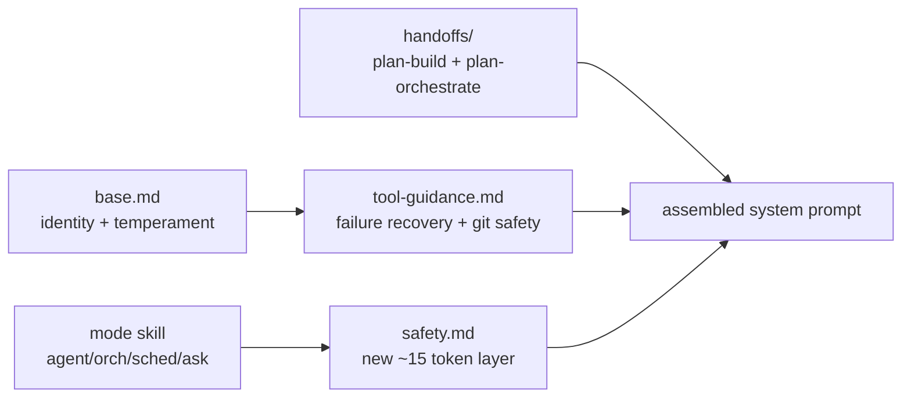

## Summary
Improve the core prompts in Pyrola's agent system to be more effective without bloating token count. Focus on high-impact gaps: identity/temperament, failure recovery, handoff quality, and basic safety — all kept under ~20 words per addition.

## Context
Pyrola is a local-first coding agent competing with Cursor. Running Kat-Coder-v2.5 on 128GB RAM hardware means every token in the system prompt costs real compute. The current prompts are functional but thin — especially `base.md` and handoff messages. Goal: deepen behavior without adding bloat.

## Architecture

## Approach

### 1. Deepen `base.md` (+~40 tokens total)
Replace the current 3-line identity with a compact but grounded anchor:
- Who you are + default temperament (thorough, cautious with mutations, ask when uncertain)
- One line on failure recovery pattern
- Keep it under 6 lines

### 2. Harden `tool-guidance.md` (+~20 tokens)
Add one short bullet for each:
- What to do when a tool fails (read error → adjust approach → escalate via ask_user if stuck)
- Git operations are destructive by default — confirm before force-push, merge, reset

### 3. Beef up handoff prompts (+~30 tokens each)
`plan-build.md`: add context about *how* to approach the plan (read first, prioritize todos in order, summarize changes at end)
`plan-orchestrate.md`: already decent but add "review sub-agent output for correctness before marking todo complete"

### 4. Add `safety.md` as a new ~15-token skill-layer
One short file: core principles only — don't delete data without confirmation, prefer small changes, verify before committing. Loaded once at the end of prompt chain.

## Test plan
- [ ] Run agent mode on a real task — does it recover from tool failures gracefully?
- [ ] Spawn a sub-agent with new handoff — does it produce more structured output?
- [ ] Verify total system prompt token count stays under ~200 words across all files
- [ ] Compare behavior before/after on edge cases (ambiguous request, destructive operation)
