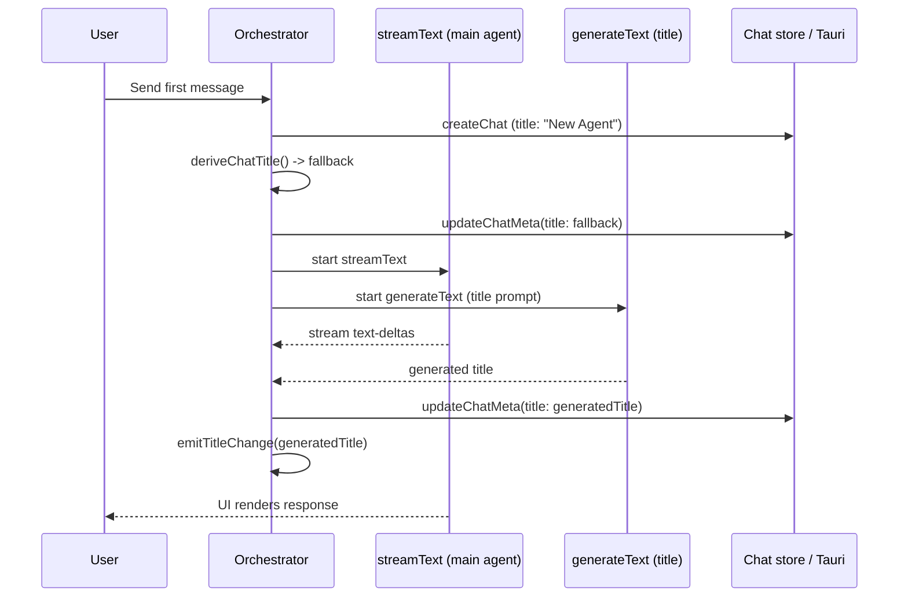

## Summary

Currently, chat naming happens in two separate phases:
1. A synchronous fallback title is derived from the first user message (first line, truncated to 80 chars)
2. After the chat is created, a separate `runSideTask` call fires off a `generateText` request to produce a better title

This plan inlines the title generation into the first agent turn, running it as a parallel `generateText` call alongside the main `streamText` call. The fallback title is still used immediately, and the generated title replaces it when ready.

## Context

### Current flow (orchestrator.ts lines ~880-910)

```typescript
if (isFirstUserMessage) {
  // 1. Immediate fallback title
  const fallbackTitle = deriveChatTitle(userText)
  if (fallbackTitle) {
    await updateChatMeta(projectSlug, chatId, { title: fallbackTitle })
    emitTitleChange(fallbackTitle)
  }

  // 2. Separate side task - fires after main turn starts
  runSideTask({
    projectSlug, chatId, prompt: userText, settings: input.settings,
  }).then((generatedTitle) => {
    if (generatedTitle && !isDefaultChatTitle(generatedTitle)) {
      emitTitleChange(generatedTitle)
    }
  })
}
```

### `runSideTask` (run-side-task.ts)

- Calls `generateText` with the title role model
- Uses the `side-tasks/chat-title.md` prompt
- Resolves call options via `resolveSideTaskCallOptions` (maxOutputTokens: 256)
- Updates chat meta and refreshes sidebar on completion

### Key files

- `src/services/harness/orchestrator.ts` - Main orchestrator, where naming logic lives
- `src/services/harness/run-side-task.ts` - Current separate title generation
- `src/utils/derive-chat-title.ts` - Synchronous fallback title derivation
- `src/services/models/resolve-model-for-role.ts` - Model resolution by role (including 'title')
- `src/services/models/resolve-model-call-options.ts` - Call options resolution

## Architecture



The key change: instead of `runSideTask` being called as a fire-and-forget after the turn starts, we start the title generation as a parallel task that runs alongside the main stream. This uses `Promise.all` pattern from the AI SDK docs.

## Approach

### Step 1: Create an inline title generation utility

Create a new utility function (or inline directly in orchestrator) that generates a title using `generateText` with the same title-role model configuration, but with a tighter prompt and minimal tokens.

The prompt in `side-tasks/chat-title.md` is already lightweight:
```
Generate a short chat title (max 6 words, no quotes) for this user message:

{{prompt}}
```

We can keep this prompt as-is since it's already concise.

### Step 2: Inline the title generation in orchestrator.ts

Replace the `runSideTask` call with a direct `generateText` call that runs in parallel with the main stream. The structure:

```typescript
// In orchestrator.ts, inside the isFirstUserMessage block:

const fallbackTitle = deriveChatTitle(userText)
if (fallbackTitle) {
  await updateChatMeta(projectSlug, chatId, { title: fallbackTitle })
  emitTitleChange(fallbackTitle)
}

// Start title generation in parallel with the main harness stream
const titlePromise = generateChatTitle({
  projectSlug, chatId, prompt: userText, settings: input.settings,
}).catch(() => null)

// Start the main harness stream
const harnessPromise = runHarnessStream({ ...streamInput })

// Wait for both to complete
await Promise.all([harnessPromise, titlePromise])
```

The `generateChatTitle` function would:
1. Check `chat.autoTitle` setting (same as runSideTask)
2. Resolve the title model via `resolveParsedModelForRole('title', ...)`
3. Create the model
4. Call `generateText` with the chat-title prompt
5. Parse the result, update chat meta, emit title change
6. Return the title or null on error

### Step 3: Make it lighter

The current `runSideTask` already uses `resolveSideTaskCallOptions` which sets `maxOutputTokens: 256`. We can make it even lighter:

- Reduce `maxOutputTokens` to 64 (title is max 6 words, ~30 tokens)
- Keep temperature at 0.3-0.5 for deterministic output
- Use the existing title-role model (already a small/fast model if configured)

### Step 4: Remove runSideTask dependency for title

Since the title generation is now inlined, the `runSideTask` import and call in orchestrator.ts can be removed. The `runSideTask` function may still be used elsewhere - check for other usages before removing.

### Step 5: Error handling

Title generation should be completely silent on failure - no toast, no error propagation. If it fails, the fallback title remains.

## Test plan

1. **Happy path**: Send a first message, verify the fallback title appears immediately, then verify it gets replaced by the generated title when ready
2. **autoTitle disabled**: Send a first message with `chat.autoTitle: false`, verify no title generation happens
3. **No title model configured**: Verify graceful fallback to default model or no generation
4. **Subsequent messages**: Verify title generation only happens on the first user message
5. **Error resilience**: Verify a failing title generation doesn't affect the main agent response
6. **Title quality**: Verify generated titles are concise (max 6 words) and don't include quotes