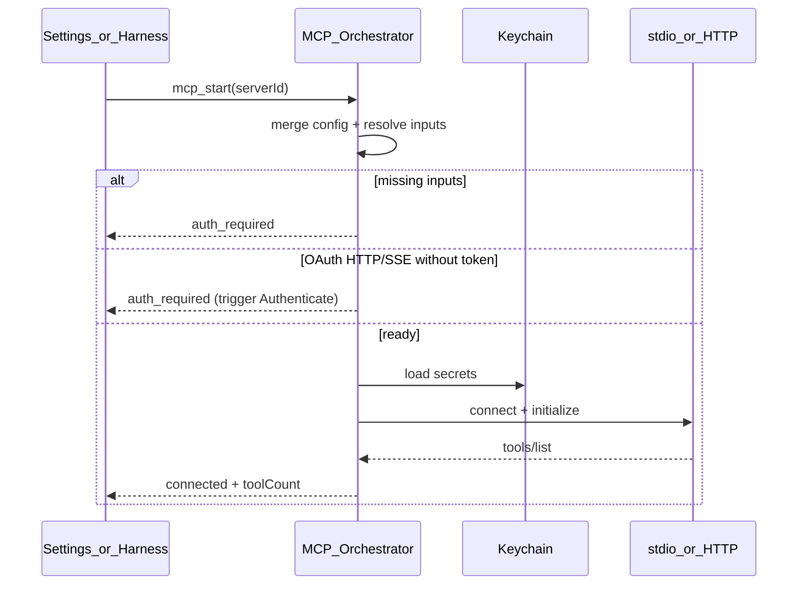

## Summary

Unified MCP client for Pyrola covering **stdio**, **HTTP**, and **SSE** transports; all VS Code `mcp.json` auth mechanisms (env, inputs, headers/Bearer, OAuth/DCR); token storage in OS keychain; lifecycle wired to Settings UI and agent harness.

**Studio rendering** remains in [mcp-studio plan](../mcp-studio-2026-07-15-215200/PLAN.md). This plan owns transport + auth + tool execution only.

**Interop target:** [VS Code MCP configuration](https://code.visualstudio.com/docs/agents/reference/mcp-configuration) and [MCP Authorization spec (2025-11-25)](https://modelcontextprotocol.io/specification/2025-11-25/basic/authorization).

---

## Config sources

```text
~/.pyrola/mcp.json              # personal servers
<repo>/.pyrola/mcp.json        # project servers (same server id → project wins)
```

Merge at load time into `EffectiveMcpConfig`. No secrets in JSON files.

Reference stub: [`.pyrola/mcp.json`](../../../.pyrola/mcp.json).

### mcp.json shape (VS Code compatible)

```jsonc
{
  "servers": {
    "shadcn": {
      "command": "npx",
      "args": ["shadcn-vue@latest", "mcp"]
    },
    "remote-api": {
      "type": "http",
      "url": "https://api.example.com/mcp",
      "headers": {
        "Authorization": "Bearer ${input:api-token}"
      }
    },
    "slack": {
      "type": "sse",
      "url": "https://mcp.slack.com/sse",
      "oauth": {
        "clientId": "example-client-id"
      }
    }
  },
  "inputs": [
    {
      "id": "api-token",
      "type": "promptString",
      "description": "API token",
      "password": true
    }
  ]
}
```

**Transport inference:**

| Config signals | Transport |
|----------------|-----------|
| `command` present | **stdio** (default when no `type`) |
| `"type": "http"` + `url` | **HTTP** (Streamable HTTP) |
| `"type": "sse"` + `url` | **SSE** |

---

## Architecture

```text
┌─────────────────────────────────────────────────────────────────┐
│  Vue — Settings UI / harness                                    │
│  use-mcp-store, call_mcp_tool                                     │
└───────────────────────────┬─────────────────────────────────────┘
                            │ Tauri invoke
┌───────────────────────────▼─────────────────────────────────────┐
│  TypeScript orchestration (src/services/mcp/)                     │
│  - load + merge mcp.json                                          │
│  - resolve inputs/env → keychain                                  │
│  - HTTP/SSE: @modelcontextprotocol/client transports + OAuth      │
│  - route stdio RPC to Rust                                        │
└───────────────┬─────────────────────────────┬─────────────────────┘
                │                             │
┌───────────────▼──────────────┐   ┌──────────▼────────────────────┐
│  Rust (src-tauri/)           │   │  System                        │
│  - stdio spawn + JSON-RPC    │   │  - keychain                    │
│  - process kill / restart    │   │  - browser (OAuth)             │
│  - env substitution cwd    │   │  - localhost callback (OAuth)  │
└──────────────────────────────┘   └────────────────────────────────┘
```

**Split rationale:**

- **stdio** in Rust — process management, env, cwd scoped to project root, capability sandboxing
- **HTTP/SSE** in TS — reuse `@modelcontextprotocol/client` OAuth, discovery, DCR, PKCE; HTTP via existing Rust `proxy_provider_request` if CSP requires

---

## Transport details

### 1. stdio

| Concern | Approach |
|---------|----------|
| Spawn | `tokio::process::Command` with `command` + `args` from config |
| Cwd | Active project `rootPath` |
| Env | Merge process env + `servers.<id>.env` after `${input:}` / `${env:}` substitution |
| envFile | Resolve path relative to project; load key=value pairs |
| Protocol | MCP JSON-RPC over stdin/stdout (newline-delimited messages) |
| Auth | **No OAuth** per MCP spec — credentials via env/inputs only |
| Lifecycle | One OS process per server id; restart on Refresh |

**Rust commands:** `mcp_stdio_start`, `mcp_stdio_send`, `mcp_stdio_stop`.

### 2. HTTP (Streamable HTTP)

| Concern | Approach |
|---------|----------|
| Client | `@modelcontextprotocol/client` `StreamableHTTPClientTransport` |
| URL | `servers.<id>.url` |
| Headers | Static + `Authorization: Bearer ${input:token}` after resolution |
| OAuth | See OAuth section — `oauth.clientId` optional pre-registration |
| Proxy | Outbound requests through Tauri HTTP proxy when needed |
| Auth spec | MCP 2025-11-25 authorization (401 → PRM discovery → OAuth 2.1 + PKCE) |

### 3. SSE

| Concern | Approach |
|---------|----------|
| Client | `@modelcontextprotocol/client` SSE transport (or HTTP transport if server unifies) |
| Same auth | Headers, Bearer inputs, OAuth identical to HTTP |
| Reconnect | Exponential backoff on disconnect; Refresh forces full reconnect |

---

## Auth mechanisms

### A. inputs (VS Code `inputs` array)

| `type` | UI | Storage |
|--------|-----|---------|
| `promptString` | Settings Authenticate dialog or first-connect prompt | Keychain `mcp:<server-id>:input:<input-id>` |
| `password: true` | Masked field | Same keychain scope |

Substitution patterns in config:

- `${input:api-token}` in `headers`, `env`, `args`
- Resolved at **start** and cached until Log out

### B. env / envFile

| Mechanism | Behavior |
|-----------|----------|
| `env: { "KEY": "value" }` | Passed to stdio spawn or used for header templates |
| `envFile: ".env"` | Load from project root; never commit secrets |
| `${env:VAR}` | Read from loaded envFile + process env at resolve time |

### C. Bearer / static headers (HTTP/SSE)

```jsonc
"headers": {
  "Authorization": "Bearer ${input:api-token}",
  "X-Api-Key": "${input:api-key}"
}
```

- After input resolution → attach to every MCP HTTP request
- **No** `git_commit`-style auto-use — only when server connected and harness calls tool
- Log out clears resolved values from memory + keychain

### D. OAuth 2.1 (HTTP/SSE only)

Follow [MCP Authorization 2025-11-25](https://modelcontextprotocol.io/specification/2025-11-25/basic/authorization).

**Normative RFCs / drafts:**

| Spec | Use |
|------|-----|
| OAuth 2.1 draft | Auth code + PKCE |
| RFC 7636 | PKCE S256 |
| RFC 9728 | Protected Resource Metadata discovery |
| RFC 8414 | Authorization Server Metadata |
| RFC 7591 | Dynamic Client Registration (fallback) |
| RFC 8707 | `resource` parameter = MCP server URL |
| RFC 8252 | Native app loopback redirect `http://127.0.0.1:<port>` |
| Client ID Metadata Documents | Preferred when no pre-registration |

**Implementation stack (do not hand-roll protocol):**

1. **`@modelcontextprotocol/client`** — `OAuthClientProvider`, `auth()`, `finishAuth()`, token refresh
2. **`tauri-plugin-oauth`** — temporary localhost server for redirect capture
3. **`tauri-plugin-opener`** — open system browser for `/authorize`
4. **Keychain** — `saveTokens`, `saveClientInformation`, input secrets

**PyrolaOAuthProvider** (implements `OAuthClientProvider`):

| Method | Implementation |
|--------|----------------|
| `redirectUrl` | `http://127.0.0.1:{port}/callback` from `tauri-plugin-oauth` |
| `redirectToAuthorization(url)` | `open(url)` in browser |
| `saveTokens` / `tokens()` | Keychain `mcp:<server-id>:oauth:tokens` |
| `saveClientInformation` | `~/.pyrola/mcp-clients/<server-id>.json` (client_id only, no secrets) |
| `clientMetadata` | `client_name: "Pyrola"`, `redirect_uris`, `token_endpoint_auth_method: "none"` |

**Registration priority** (per MCP spec):

1. Pre-registered `oauth.clientId` from `mcp.json`
2. Client ID Metadata Document (if AS supports)
3. DCR via `registration_endpoint`
4. User prompt for client id/secret (last resort)

**Refresh / 401 handling:**

- On `401` from MCP server: attempt `refresh_token` exchange via SDK
- If refresh fails: set status `auth_required`; Settings **Authenticate** re-runs flow
- Settings **Refresh** button: `mcp_refresh` = stop → OAuth token check → reconnect → `tools/list`
- Learn from [VS Code #263990](https://github.com/microsoft/vscode/issues/263990) — do not leave server stuck in error after expiry

**Log out (`mcp_logout`):**

- Clear keychain entries matching `mcp:<server-id>:*`
- Delete cached OAuth client registration if DCR-issued (optional revoke RFC 7009)
- Stop transport; status → `auth_required`

### E. stdio + OAuth

**Not supported.** If user configures `oauth` on a stdio server, show Settings warning: "OAuth applies to HTTP/SSE transports only."

---

## Connection status model

```ts
type McpServerStatus =
  | 'stopped'
  | 'starting'
  | 'refreshing'   // UI sub-state while mcp_refresh in flight
  | 'connected'
  | 'error'
  | 'auth_required'

type McpServerState = {
  id: string
  transport: 'stdio' | 'http' | 'sse'
  scope: 'personal' | 'project' | 'overridden'
  status: McpServerStatus
  errorMessage?: string
  toolCount?: number
  lastConnectedAt?: string
}
```

Emitted to UI via `mcp-status-changed` event (Tauri event or reactive store).

---

## Lifecycle commands

| Tauri command | Behavior |
|---------------|----------|
| `mcp_list_servers` | Merged config + runtime status per server |
| `mcp_start { serverId }` | Resolve auth → connect transport → `initialize` → cache `tools/list` |
| `mcp_stop { serverId }` | Kill stdio process or disconnect HTTP/SSE |
| `mcp_refresh { serverId }` | Stop → refresh OAuth token if needed → reconnect → `tools/list`; emit `refreshing` status |
| `mcp_refresh_all {}` | Sequential `mcp_refresh` for all `connected` \| `error` servers |
| `mcp_list_tools { serverId }` | Return cached tools (name, description, inputSchema) |
| `mcp_call_tool { serverId, tool, args }` | Execute tool; return structured result to harness |
| `mcp_logout { serverId }` | Clear secrets + disconnect |
| `mcp_authenticate { serverId }` | Run input prompts or OAuth browser flow |

### Start sequence



---

## Harness integration

### `call_mcp_tool` built-in tool

```ts
// Tool schema exposed to model
call_mcp_tool({
  server: string,   // server id from mcp.json
  tool: string,     // tool name from tools/list
  arguments: object // validated against inputSchema
})
```

| Mode | Allowed |
|------|---------|
| Ask | Yes (read-oriented MCP tools only — server policy) |
| Plan | Yes |
| Studio | Yes |
| Agent | Yes |

**Allowlist:** `~/.pyrola/settings.json` → `mcp.allowServers: string[]` or per-project override. Default: all configured servers.

**Errors:** Surface MCP tool errors as harness `tool-result` with `isError: true`; `toast.error` only on connection failures.

### Context usage

Serialized MCP tool schemas count toward **MCP & dynamic tools** bucket ([context-usage plan](../context-usage-2026-07-15-221100/PLAN.md)). Re-count on `mcp_refresh` and connect/disconnect.

---

## Key modules

```text
src/schemas/mcp-config.ts
src/types/mcp/mcp-server-status.ts
src/types/mcp/mcp-tool-descriptor.ts
src/services/mcp/load-mcp-config.ts
src/services/mcp/merge-mcp-config.ts
src/services/mcp/resolve-mcp-inputs.ts
src/services/mcp/pyrola-oauth-provider.ts
src/services/mcp/mcp-orchestrator.ts
src/services/mcp/call-mcp-tool.ts
src/composables/use-mcp-store.ts

src-tauri/src/mcp/
├── stdio.rs           # spawn, read/write JSON-RPC
├── process_map.rs     # server_id → Child handle
└── commands.rs        # Tauri command handlers
```

**Dependencies to add:**

| Package | Purpose |
|---------|---------|
| `@modelcontextprotocol/client` | HTTP/SSE transport + OAuth |
| `tauri-plugin-oauth` | Localhost OAuth redirect |
| `tauri-plugin-opener` | System browser (may already exist) |

---

## Security

| Rule | Detail |
|------|--------|
| Secrets | Keychain only; never write tokens to `mcp.json` or logs |
| stdio spawn | Allowlist `command` values from config; cwd locked to project root |
| OAuth callback | Validate `state` + full redirect URL in `tauri-plugin-oauth` handler |
| Proxy | Rust HTTP proxy for remote MCP — no arbitrary URL from model |
| Log out | Must clear all `mcp:<server-id>:*` keychain entries |
| Capability | Per-agent Tauri scope — MCP stdio only for active project |

---

## Settings UI wiring

See [ui-settings-page plan](../ui-settings-page-2026-07-15-231800/PLAN.md) — **↻ Refresh** is a first-class icon on every MCP row (Cursor parity).

| UI action | Command |
|-----------|---------|
| **↻ per row** | `mcp_refresh { serverId }` |
| **↻ Refresh all** (section header) | `mcp_refresh_all {}` |
| Start / Stop | `mcp_start` / `mcp_stop` |
| Authenticate | `mcp_authenticate` |
| Log out | `mcp_logout` |
| Show tools | `mcp_list_tools` |
| Add/Edit server | Write `mcp.json` then `mcp_refresh` |

---

## Implementation phases

| Phase | Deliverable |
|-------|-------------|
| **MCP-1** | Zod `mcp.json` schema + merge loader |
| **MCP-2** | Rust stdio transport + `mcp_start/stop/call_tool` |
| **MCP-3** | inputs/env/envFile resolution + keychain |
| **MCP-4** | HTTP/SSE transport + Bearer headers |
| **MCP-5** | OAuth — `PyrolaOAuthProvider` + Authenticate flow |
| **MCP-6** | Refresh, logout, token refresh on 401 |
| **MCP-7** | `call_mcp_tool` harness + allowlist |
| **MCP-8** | Status events + Settings UI binding |

---

## Definition of done

- stdio server (e.g. `shadcn` from stub `mcp.json`) connects and lists tools
- HTTP/SSE server with Bearer `${input:}` connects after Authenticate
- HTTP/SSE server with OAuth completes browser flow via localhost callback
- Refresh re-lists tools without editing config
- Log out clears auth and returns `auth_required`
- Harness `call_mcp_tool` executes and returns results in chat
- Project `mcp.json` overrides personal server by name
- No secrets in JSON on disk; `tsc` + `lint` + `cargo check` pass
