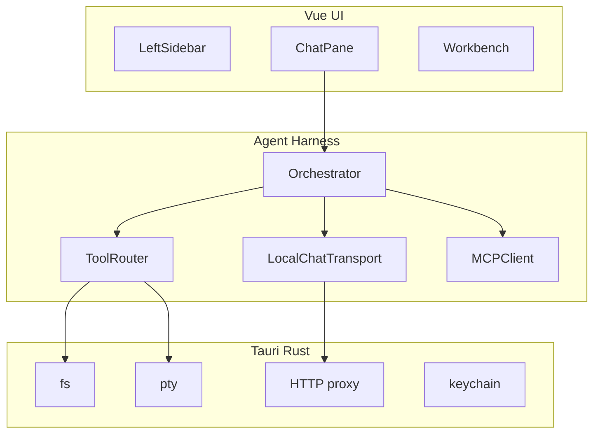

## Summary

Transform Pyrola's Tauri + Vue shell into a **local-first, BYOK, open-source agent IDE** matching Cursor Agents UX — with fleet management across projects, four chat modes (Agent, Plan, Ask, Studio), MCP/skills/sub-agents, and in-app editor/terminal/browser/studio panels.

## Chat modes (capability ladder)

| Mode | Capabilities | Writes files |
|------|--------------|--------------|
| **Ask** | Read-only exploration (grep, read, MCP read) | No |
| **Plan** | Ask + create/update plans | `.pyrola/plans/<name-timestamp>/PLAN.md` |
| **Studio** | Ask + Plan + studio artifacts & Comark reports | Plans + `.pyrola/studio/<slug>/` |
| **Agent** | Full mutating harness | Project source (gated) |

Ask does everything Plan/Studio can do for exploration — it just doesn't persist output to disk.

## Plan file convention

All plans live under `.pyrola/plans/` using **`name-timestamp/PLAN.md`**:

```text
.pyrola/plans/
  pyrola-master-plan-2026-07-15-215200/PLAN.md   ← this file
  contracts-2026-07-15-215200/PLAN.md
  ide-shell-2026-07-15-215200/PLAN.md
  ...
```

- **name** — kebab-case slug describing the plan
- **timestamp** — `YYYY-MM-DD-HHmmss` (UTC) at creation time

## Child plans

| Plan | Path |
|------|------|
| Contracts (Phase 0) | [contracts-2026-07-15-215200/PLAN.md](../contracts-2026-07-15-215200/PLAN.md) |
| IDE Shell (Phase 1) | [ide-shell-2026-07-15-215200/PLAN.md](../ide-shell-2026-07-15-215200/PLAN.md) |
| Config & Providers (Phase 2) | [config-providers-2026-07-15-215200/PLAN.md](../config-providers-2026-07-15-215200/PLAN.md) |
| Agent Harness (Phase 3) | [agent-harness-2026-07-15-215200/PLAN.md](../agent-harness-2026-07-15-215200/PLAN.md) |
| Plans, Agents, Skills (Phase 4) | [plans-agents-skills-2026-07-15-215200/PLAN.md](../plans-agents-skills-2026-07-15-215200/PLAN.md) |
| MCP & Studio (Phase 5) | [mcp-studio-2026-07-15-215200/PLAN.md](../mcp-studio-2026-07-15-215200/PLAN.md) |
| Fleet & Polish (Phase 6) | [fleet-polish-2026-07-15-215200/PLAN.md](../fleet-polish-2026-07-15-215200/PLAN.md) |

## Vision

- **BYOK** via Vercel AI SDK providers (OpenAI, Anthropic, Google, OpenRouter, self-hosted)
- **No cloud agents, no accounts** — keys in OS keychain
- **Fleet management** — agents across multiple unrelated projects
- **VS Code-shaped config** — `~/.pyrola/` (user) + `<repo>/.pyrola/` (project; project wins)

## Architecture



## Config precedence

`~/.pyrola/settings.json` → `<repo>/.pyrola/settings.json` (project wins). Same for `mcp.json`. Secrets only in user config + OS keychain.

## Success criteria

1. Register 3+ project roots with agent threads across all
2. Run Agent-mode with BYOK, streaming tools, inline todos
3. Plan mode writes `.pyrola/plans/<name-timestamp>/PLAN.md` with trackable todos
4. Studio mode generates Comark reports via MCP data sources
5. Monaco editor, bottom terminal (chat+workbench width), browser in workbench
6. Tray-resident agents; resume on reopen
7. No accounts or subscriptions

## Out of scope (v1)

Cloud sync, embeddings/vector DB, LSP, full in-app diff renderer, VS Code extension for dirty buffers, mobile check-in.
