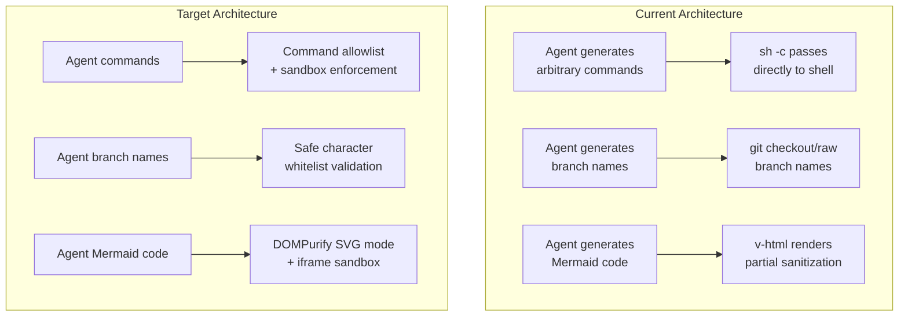

# Security Fixes Plan

## Summary

This plan addresses security findings from a comprehensive review of the Pyrola codebase (a Tauri + Vue desktop app with AI agent capabilities). The app runs arbitrary shell commands, proxies HTTP requests, executes LSP/MCP servers, and renders user-supplied content. Findings range from XSS in Mermaid rendering to command injection in git operations.

## Context

Pyrola is an AI coding assistant desktop app built with:
- **Frontend**: Vue 3 (beta) + TypeScript + Tailwind
- **Backend**: Tauri 2 (Rust) with native shell, file, HTTP, git, LSP, and MCP bridges
- **Key attack surface**: The AI agent can trigger shell commands, file writes, HTTP requests, and MCP tool calls. The app also renders user-supplied Mermaid diagrams via `v-html`.

## Architecture

```mermaid
graph TB
    subgraph Frontend["Vue Frontend (Renderer)"]
        UI[User Interface]
        Mermaid[Mermaid Renderer]
        AgentShell[Agent Shell UI]
    end

    subgraph Tauri["Tauri IPC Bridge"]
        Shell[Shell Commands]
        Git[Git Commands]
        HTTP[HTTP Proxy]
        LSP[LSP Server]
        MCP[MCP Bridge]
        FS[File System]
        Keychain[Keychain]
    end

    subgraph OS["Operating System"]
        ShellBin[Shell (/bin/zsh)]
        Rg[ripgrep]
        Node[node_modules/.bin]
        Sandbox[sandbox-exec / bwrap]
        Keyring[OS Keychain]
    end

    UI -->|IPC| Shell
    UI -->|IPC| Git
    UI -->|IPC| HTTP
    UI -->|IPC| LSP
    UI -->|IPC| MCP
    UI -->|IPC| FS
    UI -->|IPC| Keychain

    AgentShell -->|v-html| Mermaid
    AgentShell -->|IPC| Shell

    Shell -->|sh -c| ShellBin
    Shell -->|sandbox-exec| Sandbox
    Git -->|git| ShellBin
    HTTP -->|reqwest| Internet[(Internet)]
    LSP -->|spawn| Node
    MCP -->|spawn| Node
    FS -->|fs::| Disk[(Disk)]
    Keychain -->|keyring| Keyring
```

## Findings

### Finding 1: Mermaid v-html XSS (HIGH)
- **Location**: `src/components/studio/blocks/StudioBlocksMermaid.vue:62`
- **Issue**: `v-html="rendered"` renders sanitized SVG. The sanitizer strips `<script>` tags and `on*` attributes, but SVG can still contain XSS vectors:
  - `<foreignObject>` with embedded HTML/JavaScript
  - ``
  - `<a href="javascript:...">`
  - `<animate>` with `href` attribute
- **Impact**: XSS in the studio view when rendering agent-generated Mermaid diagrams
- **Fix**: Use DOMPurify (already a dependency via overrides) with `SVG` mode, or switch to an iframe with `srcdoc` and strict sandbox

### Finding 2: Git command injection via branch names (HIGH)
- **Location**: `src-tauri/src/commands/git.rs:117-133`
- **Issue**: `git_checkout_branch` and `git_branch_create` pass raw branch names to `git checkout` and `git branch -b` without sanitization. Branch names like `; rm -rf ~` or `refs/heads/evil` could cause issues.
- **Impact**: Potential command injection if the AI agent generates malicious branch names
- **Fix**: Validate branch names against git's safe character set (alphanumeric, `/`, `-`, `_`, `.`, `~`) and reject names containing special characters

### Finding 3: Shell command injection in tracked shells (MEDIUM-HIGH)
- **Location**: `src-tauri/src/commands/shell.rs:225-235`
- **Issue**: `build_tracked_command` passes agent-generated commands directly to `sh -c`. While sandboxing (Seatbelt/bwrap) mitigates the blast radius, unsandboxed shells have full access.
- **Impact**: If permissions are bypassed or sandboxing is unavailable, the agent can execute arbitrary commands
- **Fix**: This is partially mitigated by the existing permission policy and sandboxing. The main improvement is to add a command allowlist for tracked shells (similar to MCP) and ensure sandboxing is always enforced when possible.

### Finding 4: LSP binary path traversal (MEDIUM)
- **Location**: `src-tauri/src/commands/lsp.rs:469-478`
- **Issue**: `resolve_lsp_binary` checks `node_modules/.bin/<program>` but doesn't verify the resolved path is actually within the workspace or is a regular file (not a symlink).
- **Impact**: An attacker could create a symlink in `node_modules/.bin` pointing to an arbitrary binary, causing the LSP server to run from outside the workspace
- **Fix**: Canonicalize the resolved path and verify it starts with the workspace root

### Finding 5: HTTP proxy SSRF - DNS rebinding (MEDIUM)
- **Location**: `src-tauri/src/commands/http.rs:206-235`
- **Issue**: `validate_proxy_url` resolves DNS once before the request. DNS rebinding could change the IP between validation and the actual HTTP request. The redirect policy is `none` which mitigates some attack vectors.
- **Impact**: SSRF to internal services if DNS rebinding succeeds
- **Fix**: Resolve DNS again in a pre-connect hook, or use a custom connector that validates IPs at connect time

### Finding 6: Sensitive path detection in permission policy too broad (MEDIUM)
- **Location**: `src-tauri/src/services/harness/permission-policy.ts:43-45`
- **Issue**: The regex patterns `/credential/i`, `/secret/i`, `/password/i` match any path containing these words. A file like `credentials.txt` or `password-manager.ts` in a legitimate project would trigger the sensitive path guard.
- **Impact**: False positives causing unnecessary permission prompts, or worse, the patterns could be used to mask malicious paths
- **Fix**: Narrow the patterns to match only well-known credential file names and extensions, not arbitrary path segments containing these words

### Finding 7: Keychain key not fully validated (LOW)
- **Location**: `src-tauri/src/commands/keychain.rs:6-10`
- **Issue**: `require_pyrola_key` only checks for `pyrola:` prefix but doesn't validate the rest of the key. A key like `pyrola:../../etc/passwd` would pass.
- **Impact**: Potential keychain abuse if a malicious agent constructs keychain keys
- **Fix**: Add alphanumeric/underscore-only validation for the key suffix

### Finding 8: Git branch name not sanitized in checkout (MEDIUM)
- **Location**: `src-tauri/src/commands/git.rs:117-120`
- **Issue**: `git_checkout_branch` trims but doesn't validate the branch name. Git itself will reject most dangerous names, but names like `--help` or `@{-1}` could cause unexpected behavior.
- **Impact**: Git command confusion or unexpected behavior
- **Fix**: Validate branch names against a safe character whitelist

### Finding 9: Missing rate limiting on HTTP proxy (LOW)
- **Location**: `src-tauri/src/commands/http.rs`
- **Issue**: No rate limiting on HTTP proxy requests. The agent could potentially flood external endpoints or exhaust local resources.
- **Impact**: Resource exhaustion, potential abuse for DDoS
- **Fix**: Add a simple rate limiter (e.g., max N requests per minute per session)

### Finding 10: Chat ID format not validated (LOW)
- **Location**: `src-tauri/src/commands/chat.rs` (multiple commands)
- **Issue**: Chat operations accept `chat_id` as a raw string without validating it's a valid UUID. While the directory structure provides some isolation, a malformed ID could cause unexpected behavior.
- **Impact**: Minor - mostly consistency and error handling
- **Fix**: Validate chat_id format (UUID v4) in chat operations

## Architecture (Current vs. Target)



## Approach

### Phase 1: Critical XSS Fix (Finding 1)
**File**: `src/components/studio/blocks/StudioBlocksMermaid.vue`

1. Replace the custom `sanitizeMermaidSvg` function with DOMPurify configured for SVG:
   ```ts
   import DOMPurify from 'dompurify'
   
   const sanitizeMermaidSvg = (svg: string): string => {
     return DOMPurify.sanitize(svg, {
       USE_PROFILES: { svg: true, svgFilters: true },
       ALLOWED_TAGS: ['svg', 'g', 'path', 'line', 'circle', 'rect', 'polygon', 
                      'ellipse', 'text', 'tspan', 'line', 'defs', 'clipPath',
                      'marker', 'mask', 'pattern', 'use', 'foreignObject',
                      'title', 'desc', 'style', 'feDropShadow'],
       ALLOWED_ATTR: ['d', 'points', 'x', 'y', 'cx', 'cy', 'r', 'width', 
                      'height', 'fill', 'stroke', 'stroke-width', 'transform',
                      'class', 'id', 'viewBox', 'xmlns', 'href'],
       ALLOWED_URI_REGEXP: /^(?!data:|javascript:|vbscript:)/i,
     })
   }
   ```
2. Optionally wrap in an iframe with `sandbox="allow-same-origin"` for defense-in-depth.

### Phase 2: Git Command Sanitization (Findings 2, 8)
**File**: `src-tauri/src/commands/git.rs`

1. Add a `is_safe_git_ref` function:
   ```rust
   fn is_safe_git_ref(name: &str) -> bool {
     if name.is_empty() || name.len() > 256 {
       return false;
     }
     name.chars().all(|c| {
       c.is_ascii_alphanumeric() || matches!(c, '/' | '-' | '_' | '.' | '~')
     })
   }
   ```
2. Apply validation in `git_checkout_branch`, `git_branch_create`, and `git_commit` (for paths).
3. Reject names starting with `--` to prevent option injection.

### Phase 3: LSP Binary Path Validation (Finding 4)
**File**: `src-tauri/src/commands/lsp.rs`

1. In `resolve_lsp_binary`, add path canonicalization and verification:
   ```rust
   fn resolve_lsp_binary(workspace_root: &str, program: &str) -> Result<String, String> {
     let local = Path::new(workspace_root)
       .join("node_modules/.bin")
       .join(program);
     if local.is_file() {
       let canonical = local.canonicalize()
         .map_err(|e| format!("Failed to canonicalize LSP binary: {e}"))?;
       let root = Path::new(workspace_root).canonicalize()
         .map_err(|e| format!("Failed to canonicalize workspace root: {e}"))?;
       if !canonical.starts_with(&root) {
         return Err("LSP binary resolved outside workspace".to_string());
       }
       return Ok(canonical.to_string_lossy().replace('\\', "/"));
     }
     // For PATH resolution, validate the program name
     if program.contains('/') || program.contains('\\') {
       return Err("LSP program must be a basename, not a path".to_string());
     }
     Ok(program.to_string())
   }
   ```

### Phase 4: HTTP Proxy DNS Rebinding Mitigation (Finding 5)
**File**: `src-tauri/src/commands/http.rs`

1. Add a pre-connect DNS validation using a custom connector:
   ```rust
   fn build_client(request_timeout: Option<Duration>) -> Result<reqwest::Client, String> {
     let mut builder = reqwest::Client::builder()
       .connect_timeout(CONNECT_TIMEOUT)
       .redirect(reqwest::redirect::Policy::none());
     
     // Add DNS resolution validation
     let resolver = DnsResolver::default();
     builder = builder.dns_resolver(Arc::new(resolver));
     
     if let Some(timeout) = request_timeout {
       builder = builder.timeout(timeout);
     }
     builder.build().map_err(|e| e.to_string())
   }
   ```
2. Alternatively, resolve DNS at connect time by checking the resolved IP before sending.

### Phase 5: Permission Policy Path Detection Fix (Finding 6)
**File**: `src-tauri/src/services/harness/permission-policy.ts`

1. Replace the overly broad regex patterns:
   ```ts
   const SENSITIVE_PATH_PATTERNS = [
     // ... existing patterns ...
     // Replace broad patterns with specific ones
     /\.env(\.|$|\/)/i,
     /\.ssh(\/|$)/i,
     /\.aws(\/|$)/i,
     /\.gnupg(\/|$)/i,
     /\.netrc$/i,
     /\.npmrc$/i,
     /\.pypirc$/i,
     /\.kube\/config$/i,
     /\.docker\/config\.json$/i,
     /id_(rsa|dsa|ecdsa|ed25519)$/i,
     /\.pem$/i,
     /\.key$/i,
     /\.p12$/i,
     /\.pfx$/i,
     /\.jks$/i,
     /\/credentials(\.json)?$/i,
     /\/secrets\.json$/i,
   ]
   ```

### Phase 6: Keychain Key Validation (Finding 7)
**File**: `src-tauri/src/commands/keychain.rs`

1. Strengthen key validation:
   ```rust
   fn require_pyrola_key(key: &str) -> Result<(), String> {
     if !key.starts_with(KEY_PREFIX) {
       return Err("Keychain key must start with 'pyrola:'".to_string());
     }
     let suffix = &key[KEY_PREFIX.len()..];
     if suffix.is_empty() || !suffix.chars().all(|c| c.is_ascii_alphanumeric() || c == '_' || c == '-' || c == '.') {
       return Err("Keychain key suffix must contain only alphanumeric characters, underscores, hyphens, and dots".to_string());
     }
     Ok(())
   }
   ```

### Phase 7: Rate Limiting on HTTP Proxy (Finding 9)
**File**: `src-tauri/src/commands/http.rs`

1. Add a simple rate limiter state:
   ```rust
   pub struct HttpStreamRegistry {
     cancels: Mutex<HashMap<String, oneshot::Sender<()>>>,
     rate_limit: Mutex<RateLimiter>,
   }
   
   struct RateLimiter {
     requests: Vec<std::time::Instant>,
   }
   
   impl RateLimiter {
     fn new() -> Self {
       Self { requests: Vec::new() }
     }
     
     fn allow(&mut self) -> bool {
       let now = std::time::Instant::now();
       self.requests.retain(|t| now.duration_since(*t).as_secs() < 60);
       if self.requests.len() >= 100 {
         return false;
       }
       self.requests.push(now);
       true
     }
   }
   ```

### Phase 8: Chat ID Validation (Finding 10)
**File**: `src-tauri/src/commands/chat.rs`

1. Add UUID validation in chat operations.

## Test Plan

### Unit Tests (Rust)
1. **Git ref validation**: Test `is_safe_git_ref` with safe names (`feature/foo`, `v1.0.0`), unsafe names (`; rm -rf`, `--help`, `refs/heads/evil`, empty strings, 257-char strings)
2. **LSP binary validation**: Test `resolve_lsp_binary` with symlinks pointing outside workspace, PATH binaries with `/` in name, valid node_modules binaries
3. **Keychain key validation**: Test `require_pyrola_key` with valid keys, `pyrola:../../etc/passwd`, `pyrola:`, `pyrola:abc def`
4. **HTTP proxy DNS validation**: Test that blocked IPs are rejected at connect time
5. **Mermaid sanitization**: Test DOMPurify SVG mode with `<foreignObject>`, ``, `<animate href>`

### Unit Tests (TypeScript)
1. **Permission policy**: Test that `credentials.txt` and `password-manager.ts` no longer trigger sensitive path detection
2. **Chat ID validation**: Test UUID v4 format validation

### Integration Tests
1. **Mermaid XSS**: Render agent-generated Mermaid code containing XSS vectors and verify they are neutralized
2. **Git branch creation**: Attempt to create a branch with a malicious name and verify rejection
3. **HTTP proxy**: Verify DNS rebinding is mitigated (test with a domain that changes IP after initial resolution)
4. **LSP server**: Verify that LSP servers can only be launched from within the workspace

### Manual Testing
1. Open the studio view and render a Mermaid diagram with embedded `<foreignObject>` containing JavaScript
2. Run `git checkout --help` and `git branch --evil` and verify rejection
3. Configure an MCP server with a path containing `/` and verify rejection
4. Attempt to store a secret with a path-traversal keychain key name