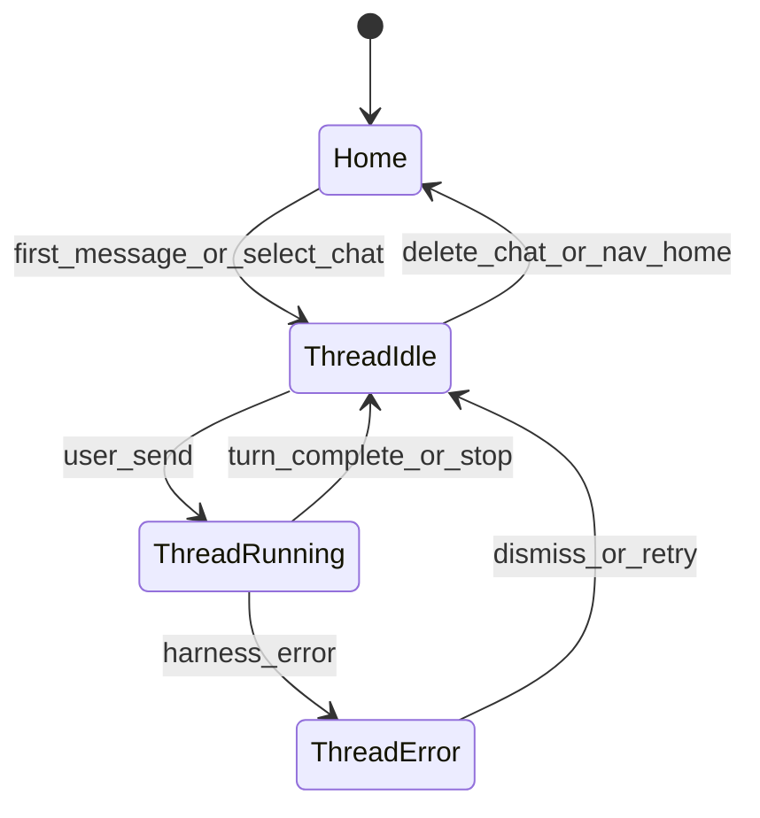

## Summary

Panel **2 of 5**. Center column: agent conversation, thread chrome, prompt input, and context footer. Primary interaction surface. Uses vendored **ai-elements** for stream + input after alias fix.

## ASCII — active thread

```text
┌─ CenterPane (AgentThreadView) ─────────────────────────────────────────────┐
│ ┌─ ThreadHeader ──────────────────────────────────────────────────────────┐ │
│ │  Crons memory restarts                              [📌] [mode ▾] [⋯]  │ │
│ │  3 of 3 To-dos completed                                                │ │
│ └─────────────────────────────────────────────────────────────────────────┘ │
│                                                                             │
│ ┌─ MessageStream (scroll) ────────────────────────────────────────────────┐ │
│ │  [user bubble]                                                          │ │
│ │      memory still climbing after cron restarts…                         │ │
│ │                                                                         │ │
│ │  ▸ Thought for 2s                                                       │ │
│ │  [assistant]                                                            │ │
│ │      I checked the branch diff and terminal logs…                       │ │
│ │                                                                         │ │
│ │  Explored 729123.txt, ran 3 commands                          [copy][↻] │ │
│ │  Explored 4 files, 2 searches, 1 tool                                   │ │
│ │  Editing sync-messaging-sheet.ts                        +6 -11          │ │
│ │                                                                         │ │
│ │  ● Planning next moves…                                                 │ │
│ └─────────────────────────────────────────────────────────────────────────┘ │
│                                                                             │
│ ┌─ PromptInput ───────────────────────────────────────────────────────────┐ │
│ │  [+]  Send follow-up…                    [Fable 5 High ▾] [🎤] [■ stop] │ │
│ └─────────────────────────────────────────────────────────────────────────┘ │
│ ┌─ ContextBar ────────────────────────────────────────────────────────────┐ │
│ │  📝 dedupe-message-sheet    💻 This Mac                    ( 52% ) ○   │ │
│ └─────────────────────────────────────────────────────────────────────────┘ │
└─────────────────────────────────────────────────────────────────────────────┘
```

## ASCII — home empty state (no active chat)

```text
┌─ CenterPane (HomeView) ────────────────────────────────────────────────────┐
│  Home  >  💻 This Mac                                                      │
│                                                                             │
│                    ┌─────────────────────────────────────┐                  │
│                    │ [+] Plan, Build, /skills, @context │                  │
│                    │              [model ▾]  [🎤]      │                  │
│                    └─────────────────────────────────────┘                  │
│                                                                             │
│              [ Plan New Idea ]          [ Multitask ]                       │
│                                                                             │
│     Tell Pyrola to use subagents to break down tasks in parallel.          │
└─────────────────────────────────────────────────────────────────────────────┘
```

## ASCII — thread header menu (⋯)

```text
        ┌────────────────────┐
        │ Rename thread      │
        │ Pin / Unpin        │
        │ Duplicate (fork)   │
        │ Delete thread…     │
        │ ─────────────────  │
        │ Export transcript  │
        └────────────────────┘
```

## ASCII — mode selector (in header or input)

```text
        ┌──────────────┐
        │ Ask          │  read-only
        │ Plan         │  writes PLAN.md
        │ Studio       │  plans + studio artifacts
        │ Agent        │  full harness
        └──────────────┘
```

---

## Control reference

### A. ThreadHeader

| Control | Action | Data |
|---------|--------|------|
| **Title** | Inline rename on double-click or via ⋯ menu | `meta.title` |
| **Pin** | Toggle pin (syncs sidebar) | `meta.pinned` |
| **Mode badge** | Dropdown — switch chat mode | `meta.mode`; tool allowlist per [agent-harness](../agent-harness-2026-07-15-215200/PLAN.md) |
| **⋯ menu** | Rename, Pin, Fork, Delete, Export | chat CRUD commands |
| **Todo progress** | `N of M To-dos Completed` — visible in Plan/Agent when plan active | Parsed from active `PLAN.md` frontmatter or harness events |
| **Back** (optional) | Return to Home when no history | router |

**Todo strip:** Hidden when no linked plan or mode is Ask. Click opens Plan tab in right workbench.

### B. MessageStream

| Element | Component | Behavior |
|---------|-----------|----------|
| **User message** | ai-elements `Message` (user role) | Rounded bubble; copy on hover |
| **Assistant message** | ai-elements `Message` + markdown | Thumbs up/down, copy, retry on hover |
| **Reasoning block** | ai-elements `Reasoning` | Collapsible "Thought for Ns" |
| **Tool summary row** | Custom `ActivitySummary` | Collapsed: "Explored 4 files, 2 searches, 1 tool" |
| **File edit summary** | ai-elements `Commit` / `CommitFileChanges` | `Editing path +N -M`; click → Editor tab diff |
| **Tool cards** | ai-elements `Tool` | Expandable input/output per tool call |
| **Worked for** | `TurnTiming` label | "Worked for 57s" after turn completes |
| **Live status** | Footer of stream | "Running 1 command", "Thinking", "Planning next moves" |
| **Slash command pill** | Badge | e.g. `/review-bugbot` when user invoked skill |

**Scroll:** ai-elements `Conversation` auto-scrolls on new content; user scroll-up pauses stick-to-bottom until click "scroll to bottom".

**Streaming:** Assistant text streams token-by-token; tool cards appear when tool-call starts.

### C. PromptInput

| Control | Action | Notes |
|---------|--------|-------|
| **+ (attach)** | Open attachment menu: Files, Images, @-mention picker | `@` inserts file/symbol context chips |
| **Text area** | Multi-line; `Enter` send, `Shift+Enter` newline | Placeholder: "Send follow-up" (thread) or home placeholder |
| **Model selector** | Dropdown from configured providers | Persists to `meta.model` on send |
| **Mode** (if not in header) | Ask / Plan / Studio / Agent | Same as mode badge |
| **Microphone** | Voice input (v1.5 — stub disabled in v1) | ai-elements mic-selector |
| **Stop** | Abort active harness stream | Square icon; visible only while `status: running` |
| **Plan New Idea** (home only) | `Shift+Tab` — create Plan-mode chat | Shown below home input |
| **Multitask** (home only) | Enable parallel subagent mode for next message | Fleet concurrency from settings |

**@-mentions:** File paths, folders, symbols, MCP resources. Chips shown above input; counted in context budget.

**Slash commands:** `/skill-name`, `/review-bugbot`, etc. Autocomplete on `/`.

### D. ContextBar (footer below input)

| Control | Action | Data |
|---------|--------|------|
| **Branch chip** | Display only — current git branch | `git_branch` Tauri command |
| **Machine label** | `This Mac` or custom hostname from settings | `~/.pyrola/settings.json` |
| **Context % ring** | Click → `ContextUsagePanel` popover | [context-usage plan](../context-usage-2026-07-15-221100/PLAN.md) |
| **Task/branch label** (left) | Agent branch name or chat slug | From harness metadata when agent uses worktree |

**No click-to-checkout** on branch in v1 (informational only per git plan).

### E. Home empty state

| Control | Action |
|---------|--------|
| **Large input** | First message creates chat in active project (or prompts project picker if none) |
| **Plan New Idea** | New chat in Plan mode with empty PLAN scaffold |
| **Multitask** | Toggle for next session — spawns subagents per fleet settings |
| **Hint text** | Static onboarding copy about subagents |

Shown when route is `/` or `/home` with no `chatId` selected.

---

## View states



| State | UI |
|-------|-----|
| `home` | Empty state input, no ThreadHeader |
| `threadIdle` | Full header + stream + input; stop hidden |
| `threadRunning` | Stop visible; live status in stream |
| `threadError` | Toast + error card in stream; retry on assistant block |
| `approvalPending` | write_file gate — banner + open diff in workbench |

---

## Component map

```text
src/views/
├── HomeView.vue
└── AgentThreadView.vue

src/components/agent/
├── ThreadHeader.vue
├── MessageStream.vue
├── ActivitySummary.vue
├── TurnTiming.vue
├── AgentPromptInput.vue      # wraps ai-elements PromptInput
└── AgentContextBar.vue

src/components/context/
├── ContextUsageIndicator.vue
└── ContextUsagePanel.vue
```

---

## Routes

| Route | View |
|-------|------|
| `/` | `HomeView` |
| `/project/:slug/chat/:id` | `AgentThreadView` |

Selecting chat from left sidebar navigates to thread route.

---

## Harness integration

- `use-agent-harness` drives stream; emits `HarnessEvent` for tool summaries, timing, context budget.
- Messages append to `messages.jsonl` after each tool result checkpoint.
- Mode change mid-thread: confirm dialog if running; update `meta.mode`.

---

## Visual spec

- Center pane fills `ResizablePanel` left of workbench; `pt-(--titlebar-height)` for frameless offset.
- Message stream: `flex-1 overflow-y-auto`; input + context bar pinned bottom.
- User bubbles: `bg-muted rounded-2xl`; assistant: full-width markdown.
- No `<style>` blocks — Tailwind + shadcn only.

---

## Deferred (not v1)

| Item | Decision |
|------|----------|
| Voice input | Stub / disabled v1 |
| Message edit/regenerate branch | Retry only on last assistant message |
| Inline todo checklist editing | Read-only progress from PLAN.md v1 |
| Agent branch checkout UI | Display branch name only; checkout via terminal or explicit ask |

---

## Definition of done

- Home and thread views render with ASCII-documented controls
- Stream shows reasoning, tool summaries, file edit counts, timing
- PromptInput sends to harness; Stop aborts
- Context bar shows branch, machine, context % with popover
- Mode selector respects capability ladder
- `tsc` + `lint` pass
