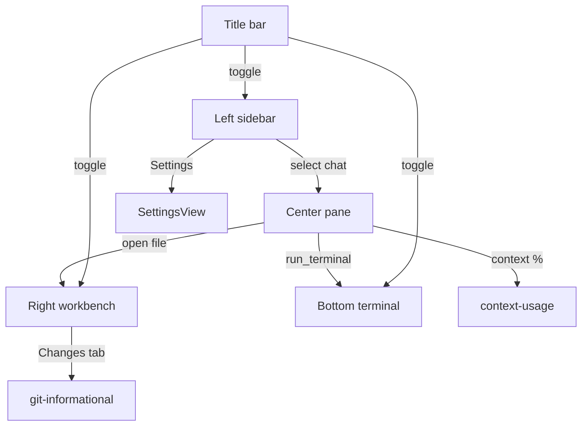

## Summary

Master index for Pyrola's **five-panel grid UI**. Each child plan documents every control, view state, ASCII mockup, and data binding for one panel. Implementation order follows the [implementation roadmap](../implementation-roadmap-2026-07-15-222700/PLAN.md) (Settings → Chats → MCP → Right sidebar → IDE → Polish).

## Grid layout

```text
┌─────────────────────────────────────────────────────────────────────────────┐
│ TitleBar                                                                    │
├──────────┬──────────────────────────────────────────────┬───────────────────┤
│          │                                              │                   │
│  LEFT    │              CENTER (chat)                   │  RIGHT (workbench)│
│ SIDEBAR  │                                              │                   │
│  ~240px  │                                              │                   │
│          ├──────────────────────────────────────────────┴───────────────────┤
│          │              BOTTOM TERMINAL (center+right width only)            │
└──────────┴──────────────────────────────────────────────────────────────────┘
```

**Key divergence from Cursor:** terminal is a **bottom panel** spanning chat + workbench, not a right-sidebar tab. See [ide-shell plan](../ide-shell-2026-07-15-215200/PLAN.md).

## Child plans

| Panel | Plan | Scope |
|-------|------|-------|
| **1 — Left sidebar** | [ui-left-sidebar](../ui-left-sidebar-2026-07-15-230000/PLAN.md) | New Agent, Search, Pinned, Settings; Projects tree; command palette |
| **2 — Center pane** | [ui-center-pane](../ui-center-pane-2026-07-15-230500/PLAN.md) | Thread header, message stream, PromptInput, context bar, context % |
| **3 — Right workbench** | [ui-right-workbench](../ui-right-workbench-2026-07-15-231000/PLAN.md) | Tab bar, + menu, Changes, Editor, Browser, Studio/Plans |
| **4 — Bottom terminal** | [ui-terminal-titlebar](../ui-terminal-titlebar-2026-07-15-231500/PLAN.md) | xterm panel, resize, collapse |
| **5 — Title bar** | [ui-terminal-titlebar](../ui-terminal-titlebar-2026-07-15-231500/PLAN.md) | Frameless chrome, window controls, panel toggles |
| **6 — Settings** | [ui-settings-page](../ui-settings-page-2026-07-15-231800/PLAN.md) | Personal/Project tabs, providers, MCP, fleet, agents/rules/skills link-out |

## Cross-panel dependencies



## Shared conventions

- **No footer** on left sidebar (no profile/plan badge — Pyrola is local/BYOK).
- **Top sidebar actions v1:** New Agent, Search, Pinned, Settings only (no Automations/Customize).
- **Projects** label (not Repositories) for fleet tree section.
- **Command palette** (`Cmd+K`) is global; Projects header search icon filters tree inline only.
- **Styling:** shadcn-vue + Tailwind only in first-party components; no `<style>` blocks per [AGENTS.md](../../../AGENTS.md).
- **ai-elements:** Use vendored components for chat stream, tools, prompt input after `@/components/ui` alias fix.

## Implementation mapping

| UI panel | Roadmap step | Backend plans |
|----------|--------------|---------------|
| Left sidebar | Step 2 (chats) + Step 6 (fleet) | [chat-persistence](../chat-persistence-2026-07-15-220100/PLAN.md), [fleet-polish](../fleet-polish-2026-07-15-215200/PLAN.md) |
| Center pane | Step 2 (chats) | [agent-harness](../agent-harness-2026-07-15-215200/PLAN.md), [context-usage](../context-usage-2026-07-15-221100/PLAN.md) |
| Right workbench | Step 4 + Step 5 | [ide-shell](../ide-shell-2026-07-15-215200/PLAN.md), [git-informational](../git-informational-2026-07-15-221700/PLAN.md), [mcp-studio](../mcp-studio-2026-07-15-215200/PLAN.md) |
| Terminal + title bar | Step 5 | [ide-shell](../ide-shell-2026-07-15-215200/PLAN.md) |
| Settings page | Step 1 | [settings-ui](../settings-ui-2026-07-15-221100/PLAN.md), [config-providers](../config-providers-2026-07-15-215200/PLAN.md) |

## Definition of done (UI specs)

- All five panels have ASCII mockups for default, empty, and key interaction states
- Every button/control has documented click behavior, keyboard shortcut, and data source
- Child plans link to implementation phases with target component paths
- No ambiguity between Cursor reference UX and Pyrola-specific decisions (documented in each plan)
