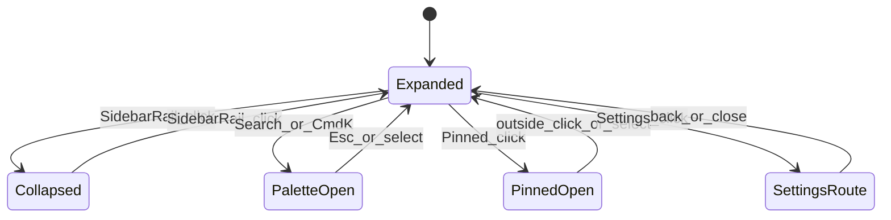
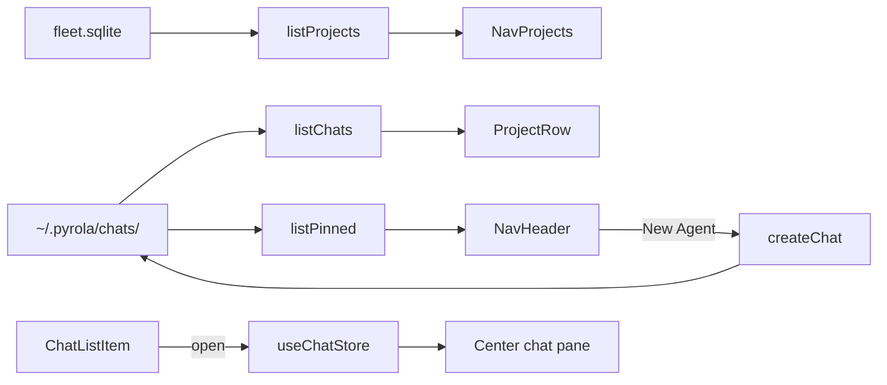

## Summary

Panel **1 of 5** in the [UI design index](../ui-design-index-2026-07-15-230000/PLAN.md). Left column: fleet navigation, chat history, global search entry, settings entry. **No footer.**

## Grid context

```text
┌─────────────────────────────────────────────────────────────────────────────┐
│ TitleBar                                                                    │
├──────────┬──────────────────────────────────────────────┬───────────────────┤
│  LEFT    │              CENTER (chat)                   │  RIGHT (workbench)│
│ SIDEBAR  │                                              │                   │
│  ~240px  ├──────────────────────────────────────────────┴───────────────────┤
│          │              BOTTOM TERMINAL                                            │
└──────────┴──────────────────────────────────────────────────────────────────┘
```

Fixed width (`--sidebar-width`), collapsible via `SidebarRail`. Remove empty [`SidebarFooter`](../../../src/components/navigation/aside/left/LeftSidebar.vue).

---

## ASCII — expanded default

```text
┌─ LeftSidebar (expanded, ~240px) ─────────────┐
│ [≡ rail hit-area on right edge]              │
│                                              │
│  ┌────────────────────────────────────────┐  │
│  │ 🤖  New Agent                          │  │
│  ├────────────────────────────────────────┤  │
│  │ 🔍  Search                             │  │
│  ├────────────────────────────────────────┤  │
│  │ 📌  Pinned                        ▾    │  │  ← opens dropdown
│  ├────────────────────────────────────────┤  │
│  │ ⚙   Settings                         │  │
│  └────────────────────────────────────────┘  │
│                                              │
│  Projects          [🔍][⏵ filter][📁+][⏷]    │  ← section header actions
│  ┌────────────────────────────────────────┐  │
│  │ ▾ platform                    ● running │  │  ← project row (collapsible)
│  │     Crons memory restarts          3m  │  │  ← active chat (highlight)
│  │     Sentry MCP review issue        1h  │  │
│  │     Yelp ad spend analysis        20h  │  │
│  │     … More (12 older)                  │  │
│  ├────────────────────────────────────────┤  │
│  │ ▸ marketing                             │  │
│  ├────────────────────────────────────────┤  │
│  │ ▸ pyrola                                │  │
│  └────────────────────────────────────────┘  │
│                                              │
│  (no footer)                                 │
└──────────────────────────────────────────────┘
```

## ASCII — collapsed (icon rail)

```text
┌──┐
│🤖│  tooltips on hover
│🔍│
│📌│
│⚙ │
│──│
│▾ │  active project chevron only; expand rail to see tree
└──┘
```

## ASCII — empty fleet

```text
│  Projects          [🔍][⏵][📁+][⏷]           │
│  ┌────────────────────────────────────────┐  │
│  │  No projects yet                       │  │
│  │  [ Add project ]                       │  │  ← same as 📁+ header action
│  └────────────────────────────────────────┘  │
```

## ASCII — Pinned dropdown

```text
        ┌─ Pinned ──────────────────────┐
        │ Crons memory restarts  platform│
        │ Yelp ad spend analysis marketing│
        │ ─────────────────────────────── │
        │ (empty) No pinned chats         │
        └─────────────────────────────────┘
```

Pinned chats **also** appear under their project with a pin icon.

## ASCII — chat row context menu

```text
        ┌──────────────────┐
        │ Open             │
        │ Rename           │
        │ Pin / Unpin      │
        │ Duplicate (fork) │
        │ Delete…          │
        └──────────────────┘
```

## ASCII — command palette (Search / Cmd+K)

```text
┌─ Search ─────────────────────────────────────────────┐
│  >  Search chats, files, commands…                   │
├──────────────────────────────────────────────────────┤
│  Chats                                               │
│    Crons memory restarts          platform           │
│  Commands                                            │
│    New Agent                                         │
│    Open Settings                                     │
│  Files                                               │
│    sync-messaging-sheet.ts                           │
└──────────────────────────────────────────────────────┘
```

---

## Control reference

### A. Sidebar chrome

| Control | Location | Action | Notes |
|---------|----------|--------|-------|
| **SidebarRail** | Right edge | Toggle expanded ↔ collapsed | shadcn `collapsible: 'offcanvas'`; state in `SidebarProvider` |
| **Window back/forward** | Title bar | Nav history | See [ui-terminal-titlebar plan](../ui-terminal-titlebar-2026-07-15-231500/PLAN.md) |

### B. NavHeader — top action list

| Control | Icon | Click | Keyboard | Data / side effects |
|---------|------|-------|----------|---------------------|
| **New Agent** | Bot | Create chat in **active project** → open empty thread | `Cmd+N` | `create_chat { projectSlug }` |
| **Search** | Search | Open **command palette** (global) | `Cmd+K` / `Cmd+P` | Not inline tree filter |
| **Pinned** | Pin | Toggle dropdown — all pinned chats cross-project | — | `list_pinned_chats {}`; `pinnedAt` desc |
| **Settings** | Settings | Navigate to `/settings` | — | [settings-ui plan](../settings-ui-2026-07-15-221100/PLAN.md) |

**Excluded v1:** Automations, Customize.

**Pinned item click:** `router.push(/project/:slug/chat/:id)` + set active chat in `use-chat-store`.

**Pinned empty state:** Disabled row "No pinned chats".

### C. Projects section header

| Control | Icon | Action |
|---------|------|--------|
| **Label "Projects"** | — | Non-interactive |
| **Search** | Magnifier | **Inline filter** — narrows project names + chat titles in tree |
| **Filter** | Filter | Toggle **All** / **Running** / **Idle** via `meta.status` |
| **Add project** | Folder+ | **AddProjectDialog** — Tauri folder picker → `fleet.sqlite` |
| **Collapse all** | Chevrons | Collapse all project rows; does not change active chat |

Filter state is local UI (not persisted).

### D. Project row

| Interaction | Behavior |
|-------------|----------|
| Click name/chevron | Expand/collapse chat list |
| Double-click name | Set **active project** (workspace root) |
| Right-click | Open folder, Remove from fleet, Rename display name |
| **● running** dot | Any chat under project has `status: running`; click filters to running in project |

**Default expand:** Active project expanded; others collapsed.

**Ordering:** `lastOpened` desc from `fleet.sqlite`.

### E. Chat row

| Interaction | Behavior |
|-------------|----------|
| Click row | Navigate; load `messages.jsonl`; highlight |
| Pin icon | Click → unpin |
| Relative time | From `meta.updatedAt` |
| Right-click / ⋯ | Rename, Pin/Unpin, Duplicate, Delete (confirm) |
| Active styling | Background + left accent bar |

**Order within project:** Pinned first (`pinnedAt` desc), then `updatedAt` desc.

**"More":** First 8 chats; "More (N older)" expands inline. No infinite scroll v1.

### F. No footer

Delete `SidebarFooter`. No profile, plan badge, or Update button.

---

## View states



| State | Visible content |
|-------|-----------------|
| `expanded` | Full labels + Projects tree |
| `collapsed` | Icons + tooltips |
| `paletteOpen` | Modal command palette |
| `pinnedMenuOpen` | Dropdown under Pinned |
| `noProjects` | Empty state + Add project CTA |
| `projectLoading` | Skeleton rows |
| `chatActive` | Highlighted row; center pane shows thread |

---

## Component map

```text
src/components/navigation/aside/left/
├── LeftSidebar.vue           # compose; no SidebarFooter
├── NavHeader.vue             # New Agent, Search, Pinned, Settings
├── NavProjects.vue           # replaces NavMain sample data
├── ProjectRow.vue
├── ChatListItem.vue
└── ProjectsSectionHeader.vue

src/components/command-palette/
└── CommandPalette.vue

src/components/fleet/
└── AddProjectDialog.vue
```

[`NavMain.vue`](../../../src/components/navigation/aside/left/NavMain.vue) → replace with `NavProjects.vue`.

---

## Data flow



**Tauri commands:** `list_chats`, `list_pinned_chats`, `pin_chat`, `delete_chat`, `fork_chat`, `register_project`, `list_projects`.

---

## Command palette sections

| Section | Sources | On select |
|---------|---------|-----------|
| **Chats** | All projects, fuzzy title | Open chat |
| **Projects** | `fleet.sqlite` | Set active project + expand in sidebar |
| **Commands** | Static registry | New Agent, Settings, Toggle sidebar, Toggle terminal |
| **Files** | Active project root | Open in workbench Editor tab |

Palette does **not** replace Projects header inline search.

---

## Visual spec

- **Width:** `16rem` expanded; `3rem` collapsed (shadcn tokens).
- **Typography:** Group label `text-xs text-muted-foreground`; chat `text-sm`; time `text-xs` right-aligned.
- **pt-8 on NavHeader:** Clear macOS traffic-light inset in frameless window.
- **Glass:** Existing vibrancy from shell; no component-level opacity overrides.

---

## Deferred (not v1)

| Item | Decision |
|------|----------|
| Automations / Customize | Not v1 |
| Chat collections inside Projects | Flat project → chats only |
| Drag-reorder chats | Not v1 |
| User-resizable sidebar width | Fixed tokens only |

---

## Definition of done

- All controls wired per table above
- Empty fleet, pinned dropdown, and context menu states implemented
- Command palette opens from Search + `Cmd+K`
- No sidebar footer
- `tsc` + `lint` pass
