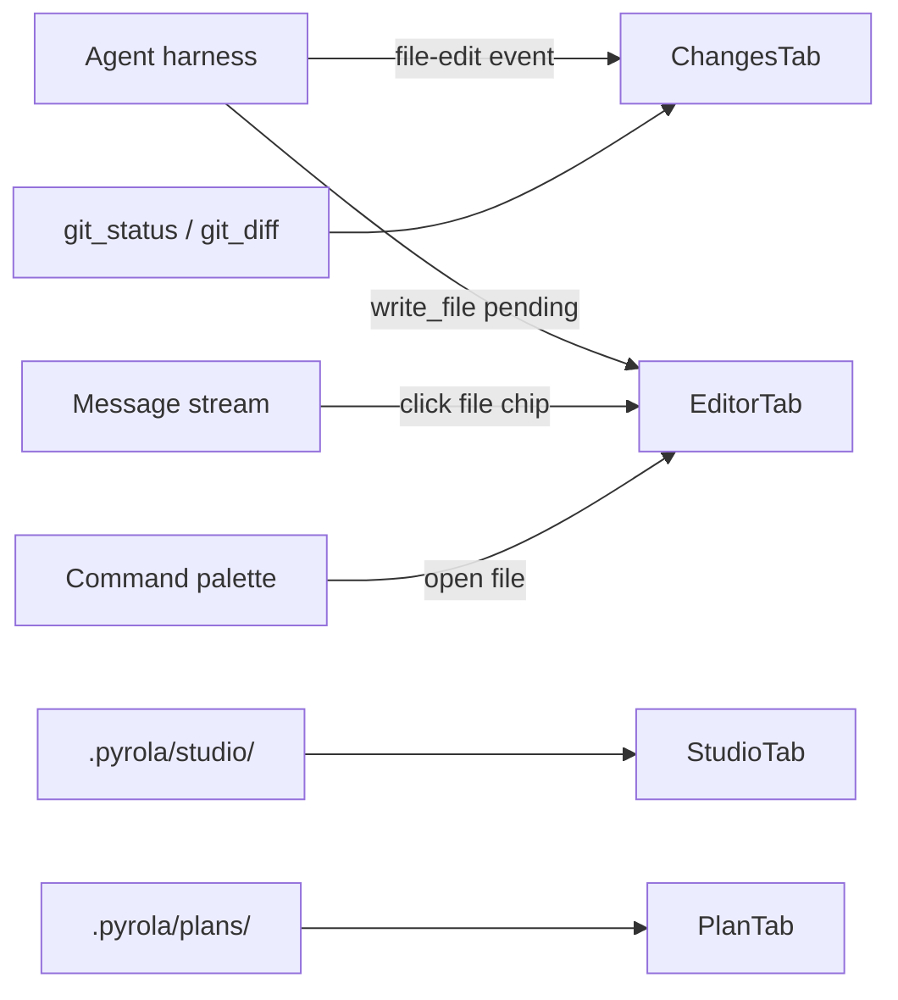

## Summary

Panel **3 of 5**. Right column: tabbed workbench for code, git status, browser, and studio/plan output. **Terminal is NOT a tab here** — it lives in the bottom panel per [ide-shell plan](../ide-shell-2026-07-15-215200/PLAN.md).

Toggle visibility via title bar `RightSidebarTrigger` and horizontal resize between center + workbench.

---

## ASCII — default with Changes tab

```text
┌─ RightWorkbench ────────────────────────────────────────────────────────────┐
│ [+] │ Changes │ sync-messaging-sheet.ts │                    [⤢] [⋯] [×] │
├─────────────────────────────────────────────────────────────────────────────┤
│  Local   fix-job-id-handling                              [ View PR ]       │
├─────────────────────────────────────────────────────────────────────────────┤
│                                                                             │
│  No uncommitted changes                                                     │
│                                                                             │
│  ┌─ Agent branch notice ─────────────────────────────────────────────────┐ │
│  │  You are not on the agent's branch: dedupe-message-sheet              │ │
│  │  [ Checkout agent's branch ]    [ View current branch ]               │ │
│  └───────────────────────────────────────────────────────────────────────┘ │
│                                                                             │
└─────────────────────────────────────────────────────────────────────────────┘
```

## ASCII — + menu (new tab picker)

```text
        ┌─ Open any file, URL… ─────────────┐
        │ 🔍 Search…                        │
        ├───────────────────────────────────┤
        │ 📄 File                           │
        │ >_ Terminal   → opens bottom panel│
        │ 🌐 Browser                        │
        │ ⎇  Changes                        │
        │ ▦  Canvas / Studio                │
        └───────────────────────────────────┘
```

**Note:** "Terminal" in + menu focuses/opens **bottom terminal**, not a workbench tab.

## ASCII — Editor tab with file tree overlay

```text
┌─ RightWorkbench ────────────────────────────────────────────────────────────┐
│ [+] │ Changes │ sync-messaging-sheet.ts * │                    [⤢] [⋯] [×] │
├─────────────────────────────────────────────────────────────────────────────┤
│  1  import { ...                    │  ┌─ File tree (overlay) ─────────┐  │
│  2  export async function sync() {  │  │ server > services > yelp      │  │
│  3    ...                           │  │   sync-messaging-sheet.ts  M  │  │
│  4  }                               │  │   ...                         │  │
│     [gutter: green/orange diff bars]│  └───────────────────────────────┘  │
└─────────────────────────────────────────────────────────────────────────────┘
```

## ASCII — Studio / Canvas tab

```text
┌─ RightWorkbench ────────────────────────────────────────────────────────────┐
│ [+] │ Changes │ Yelp Pilot Update │                              [⤢] [×]   │
├─────────────────────────────────────────────────────────────────────────────┤
│  Yelp Pilot Update  [✎]     Published ▾              [ Canvas ]             │
├─────────────────────────────────────────────────────────────────────────────┤
│  # Yelp performance on Niche                                                │
│  … Comark-rendered report with metrics grid and charts …                    │
└─────────────────────────────────────────────────────────────────────────────┘
```

---

## Control reference

### A. WorkbenchTabBar

| Control | Action |
|---------|--------|
| **+ button** | Open tab picker dropdown (search, File, Terminal→bottom, Browser, Changes, Canvas) |
| **Tab** | Click → activate; shows icon + truncated label |
| **Tab ×** | Close tab; Editor tab prompts if dirty |
| **Tab middle-click** | Close tab |
| **Drag tab** | Reorder tabs (local session state) |
| **⤢ Expand** | Maximize workbench over center pane (zen mode) |
| **⋯ menu** | Close others, Close all, Split (deferred) |
| **Panel ×** | Hide entire right workbench (`RightSidebarTrigger`) |

**Default tabs on open:** Changes (if git repo) or empty state with + menu hint.

**Tab types:** `changes` | `editor` | `browser` | `studio` | `plan`

### B. Changes tab

| Control | Action | Notes |
|---------|--------|-------|
| **Local badge** | Display only | Working tree scope |
| **Branch name** | Display current branch | From `git_branch` |
| **View PR** | Open PR URL in browser if `gh` detects remote PR for branch | Optional v1.5; stub opens GitHub compare URL |
| **File list** | Staged / unstaged / untracked groupings | `git_status` |
| **File row click** | Open Monaco diff (read-only) in Editor tab | `git_diff` |
| **Per-turn summary** | Agent turn file chips `+30 -5` | From harness events; display only |
| **Agent branch notice** | Shown when harness branch ≠ local branch | Informational |
| **Checkout agent's branch** | Run `git checkout` via **user confirm** dialog | Not automatic; explicit user action |
| **View current branch** | Show `git log -1` or branch detail | Read-only |

**No commit button, no staging UI** per [git-informational plan](../git-informational-2026-07-15-221700/PLAN.md).

### C. Editor tab

| Control | Action |
|---------|--------|
| **Monaco editor** | Syntax highlight; read/write when user edits (not agent) |
| **Gutter markers** | Modified lines from agent or user |
| **File tree toggle** | Overlay panel from right edge (search, collapse, new file deferred) |
| **Breadcrumb** | `server > services > yelp > sync-messaging-sheet.ts` |
| **Dirty indicator** | `*` on tab label |
| **Approval diff** | When agent `write_file` pending — read-only diff until Approve/Reject |

Opened from: file tree, command palette, message stream file chip, `read_file` tool link.

### D. Browser tab

| Control | Action |
|---------|--------|
| **URL bar** | Navigate Tauri webview |
| **Back/Forward/Reload** | Standard browser chrome |
| **Open external** | System browser |

v1: placeholder webview with "Enter URL" empty state.

### E. Studio / Canvas tab

| Control | Action |
|---------|--------|
| **Title** | Studio artifact name; inline rename |
| **Published ▾** | Draft / Published status for studio artifacts |
| **Canvas toggle** | Switch render mode if applicable |
| **Body** | Comark-rendered markdown from `.pyrola/studio/<slug>/` |

Opened when agent writes studio artifact or user opens from Plans list.

### F. Plan tab (optional dedicated tab type)

| Control | Action |
|---------|--------|
| **PLAN.md preview** | Rendered markdown of active plan |
| **Todo list** | Checkboxes from frontmatter — read-only v1 |

May share tab slot with Studio or open as `plan` tab type when plan mode active.

---

## View states

| State | UI |
|-------|-----|
| `closed` | Workbench hidden; center pane full width |
| `openEmpty` | + menu prompt; no tabs |
| `changesClean` | "No uncommitted changes" + optional branch notice |
| `changesDirty` | File list with badges |
| `editorClean` | Monaco with file content |
| `editorDiff` | Side-by-side or inline diff read-only |
| `approvalPending` | Diff highlighted; Approve / Reject bar at bottom |
| `studioPreview` | Comark render |
| `expanded` | Workbench covers center pane |

---

## Component map

```text
src/components/workbench/
├── WorkbenchShell.vue
├── WorkbenchTabBar.vue
├── WorkbenchTabPicker.vue
├── tabs/
│   ├── ChangesTab.vue
│   ├── EditorTab.vue
│   ├── BrowserTab.vue
│   ├── StudioTab.vue
│   └── PlanTab.vue
├── FileTreeOverlay.vue
└── AgentBranchNotice.vue

src/components/navigation/aside/right/
├── RightSidebar.vue          # existing shell
├── RightSidebarProvider.vue
└── RightSidebarTrigger.vue
```

---

## Data flow



---

## Layout integration

In [`App.vue`](../../../src/App.vue):

```text
ResizablePanelGroup (horizontal)
├── ResizablePanel — center (AgentThreadView / HomeView)
├── ResizableHandle
└── ResizablePanel — RightWorkbench (when open)
```

Workbench height = top stack only; does not include bottom terminal.

---

## Visual spec

- `border-l bg-sidebar`; tab bar `h-9` with `text-sm`.
- Active tab: bottom border accent.
- File tree overlay: `bg-sidebar/90 backdrop-blur-xl` glass pattern.
- Monaco fills remaining height below tab bar.

---

## Deferred (not v1)

| Item | Decision |
|------|----------|
| Split editor panes | Single editor tab v1 |
| PR deep integration | View PR stub v1.5 |
| Browser devtools | Not v1 |
| Tab persistence across sessions | Session-only tab list v1 |

---

## Definition of done

- Tab bar with + menu opens correct tab types
- Terminal item in + menu focuses bottom panel (not workbench tab)
- Changes tab is informational only — no commit UI
- Monaco opens files; diff view for git and approval gate
- Studio tab renders Comark placeholder
- Workbench toggles and resizes with center pane
- `tsc` + `lint` pass
