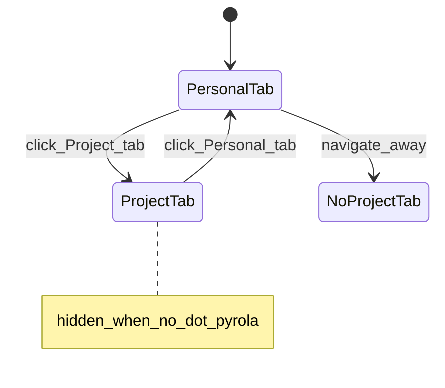
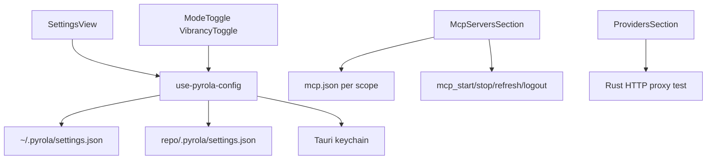

## Summary

Full-screen settings view at `/settings`, opened from left sidebar **Settings** button. Replaces center pane content (app sidebar stays visible). Implements [settings-ui plan](../settings-ui-2026-07-15-221100/PLAN.md) at the per-control level.

Child of [ui-design-index](../ui-design-index-2026-07-15-230000/PLAN.md).

---

## Layout — left nav + top tabs

```text
┌──────────┬──────────────────────────────────────────────────────────────────┐
│ LEFT     │  Settings                                                        │
│ SIDEBAR  │  ┌────────────────────────────────────────────────────────────┐  │
│ (app)    │  │  [ Personal ]  [ Project ]     ← Project hidden if no     │  │
│          │  │                                   .pyrola/ in active root   │  │
│          │  ├──────────────┬─────────────────────────────────────────────┤  │
│          │  │ Settings nav │  Section content (scroll)                     │  │
│          │  │              │                                               │  │
│          │  │ Appearance   │  (active section renders here)                │  │
│          │  │ Providers    │                                               │  │
│          │  │ MCP Servers  │                                               │  │
│          │  │ Fleet        │  ← Personal tab only                          │  │
│          │  │ General      │  ← hostname, shortcuts (Personal)             │  │
│          │  │ ───────────  │                                               │  │
│          │  │ Agents       │  ← Project tab only, link-out                 │  │
│          │  │ Rules        │                                               │  │
│          │  │ Skills       │                                               │  │
│          │  └──────────────┴─────────────────────────────────────────────┘  │
└──────────┴──────────────────────────────────────────────────────────────────┘
```

**Personal tab nav items:** Appearance, Providers, MCP Servers, Fleet, General.

**Project tab nav items:** Appearance, Providers, MCP Servers, Agents, Rules, Skills (no Fleet/General — those are user-global).

**Project tab banner** (top of content area):

```text
┌─────────────────────────────────────────────────────────────────────────────┐
│ ℹ  These settings override personal defaults for this project.              │
└─────────────────────────────────────────────────────────────────────────────┘
```

**Back navigation:** Browser back, `Esc`, or clicking a chat in left sidebar leaves Settings. No dedicated back button in v1 (sidebar provides context).

**Deep links:** `/settings?tab=personal&section=mcp` / `?tab=project&section=providers`

---

## ASCII — Appearance section

```text
┌─ Appearance ────────────────────────────────────────────────────────────────┐
│                                                                             │
│  Theme                                                                      │
│  ┌──────────┐ ┌──────────┐ ┌──────────┐                                    │
│  │  Light   │ │  Dark    │ │  System  │   ← radio card group               │
│  └──────────┘ └──────────┘ └──────────┘                                    │
│                                                                             │
│  Window glass                                                               │
│  [toggle] Enable frosted glass / vibrancy                                   │
│                                                                             │
│  Glass variant                    (visible when glass on)                   │
│  ( ) Light glass   (•) Dark glass                                           │
│                                                                             │
└─────────────────────────────────────────────────────────────────────────────┘
```

**Persistence (source of truth):** `~/.pyrola/settings.json` (Personal tab edits). Project tab Appearance section shows **override toggles** only when project `.pyrola/settings.json` has keys; otherwise inherits personal with "Using personal default" hint.

```jsonc
{
  "appearance.theme": "system",        // light | dark | system
  "appearance.glass": true,
  "appearance.glassVariant": "dark"    // dark | light
}
```

**Title bar sync:** [`ModeToggle`](../../../src/components/navigation/header/ModeToggle.vue) and [`VibrancyToggle`](../../../src/components/navigation/header/VibrancyToggle.vue) are **shortcuts** — they read/write the same persisted settings via `use-pyrola-config`, not independent `useStorage`/`useColorMode` alone. On launch, settings hydrate UI before first paint.

| Control | Action |
|---------|--------|
| **Light / Dark / System** | Set `appearance.theme`; apply `useColorMode` with `auto` for system |
| **Glass toggle** | Set `appearance.glass`; invoke `use-vibrancy` sync |
| **Glass variant** | Set `appearance.glassVariant`; re-apply native vibrancy |

Changes apply **immediately** on toggle (no Save button). Failed vibrancy invoke → `toast.error` (existing pattern in [`use-vibrancy.ts`](../../../src/composables/use-vibrancy.ts)).

---

## ASCII — Providers section

```text
┌─ Providers ─────────────────────────────────────────────────────────────────┐
│  Default model                                                              │
│  [ anthropic ▾ ]  [ claude-sonnet-4 ▾ ]          [ Test connection ]       │
│                                                                             │
│  Configured providers                                    [ + Add provider ] │
│  ┌─────────────────────────────────────────────────────────────────────┐  │
│  │ ● Anthropic          API key ••••••••sk-ant    [Test] [Edit] [⋯]     │  │
│  │ ● OpenAI             No API key                [Add key] [Edit] [⋯]  │  │
│  │ ○ LM Studio          http://localhost:1234/v1  [Test] [Edit] [⋯]   │  │
│  └─────────────────────────────────────────────────────────────────────┘  │
│                                                                             │
│  Project override: (Project tab only, when set)                             │
│  Default model overridden to openai/gpt-4o            [ Reset to personal ] │
└─────────────────────────────────────────────────────────────────────────────┘
```

### Add provider dialog

```text
┌─ Add provider ──────────────────────────────────────────┐
│  [ Search providers… ]                                  │
│  ── Popular ──                                          │
│    Anthropic   OpenAI   Google   Groq   Mistral         │
│  ── Local / compatible ──                               │
│    Ollama   LM Studio   OpenRouter                        │
│  ── Custom ──                                           │
│    Custom OpenAI-compatible endpoint                      │
│                                          [ Cancel ] [Add] │
└─────────────────────────────────────────────────────────┘
```

### Edit provider dialog (per row)

| Field | First-party | Custom OpenAI-compatible |
|-------|-------------|--------------------------|
| Display name | Read-only from registry | Editable |
| API key | Password input → keychain `apiKeyRef` | Optional password → keychain |
| Base URL | Hidden (registry default) | Required URL input |
| Test | Smoke `generateText` via Rust proxy | Same |

| Row action | Behavior |
|------------|----------|
| **Test** | `generateText` with 1-token prompt; toast success/failure |
| **Edit** | Open edit dialog |
| **Add key** | Keychain prompt when `apiKeyRef` unset |
| **⋯ menu** | Delete (custom only), Clear API key, Set as default provider |
| **+ Add provider** | Catalog picker or custom form |

**Secrets:** JSON stores only `apiKeyRef` strings. Keychain keys: `pyrola:provider:<ref>`.

**Project tab:** Same UI scoped to `<repo>/.pyrola/settings.json` merge layer. **Reset to personal** removes project override keys.

**Default model picker:** Two-step — provider dropdown (configured only) → model dropdown (from registry + `fetch` models list where supported). Persists `agent.defaultProvider` + `agent.defaultModel` at active scope.

---

## ASCII — MCP Servers section

```text
┌─ MCP Servers ───────────────────────────────────────────────────────────────┐
│  Scope: Personal (~/.pyrola/mcp.json)          [ + Add server ]            │
│                                                                             │
│  ▾ shadcn                          stdio   connected   12 tools   [⋯]      │
│  │  [Refresh]  [Log out]  [Stop]                                            │
│  │  ├── get_component_list    List shadcn-vue components                  │
│  │  ├── get_component_docs      Fetch docs for a component                  │
│  │  └── …                                                                   │
│                                                                             │
│  ▸ ai-elements-vue                 sse     auth_required          [⋯]      │
│                                                                             │
│  ▸ postgres                        stdio   stopped                [⋯]      │
└─────────────────────────────────────────────────────────────────────────────┘
```

### Add / Edit MCP server dialog (structured form — primary)

```text
┌─ Add MCP server ────────────────────────────────────────────┐
│  Server ID *        [ my-server        ]                    │
│  Transport *        (•) stdio  ( ) HTTP  ( ) SSE            │
│                                                             │
│  ── stdio ──                                                │
│  Command *          [ npx              ]                    │
│  Args               [ arg1 ] [ + ]                          │
│  Env                KEY = value  [ + ]                      │
│  Env file           [ Browse… ]                               │
│                                                             │
│  ── HTTP / SSE ──                                           │
│  URL *              [ https://…      ]                      │
│  Headers            Authorization = Bearer …  [ + ]         │
│  OAuth              [ Configure OAuth… ]                    │
│                                                             │
│  [ Advanced: Edit raw JSON in editor ]                      │
│                    [ Cancel ]  [ Save & Start ]               │
└─────────────────────────────────────────────────────────────┘
```

**Advanced:** Opens `mcp.json` (scoped file) in workbench Editor tab at server entry — for power users / VS Code parity.

### MCP row — collapsed

| Column | Content |
|--------|---------|
| Chevron | Expand/collapse tools panel |
| Name | Server id from `mcp.json` |
| Type badge | `stdio` / `http` / `sse` |
| Status pill | `connected` `starting` `stopped` `error` `auth_required` |
| Tools badge | `N tools` when connected |
| **⋯ menu** | Start/Stop, Refresh, Authenticate, Log out, Edit, Delete |

### MCP row actions

| Action | When shown | Behavior |
|--------|------------|----------|
| **Start** | `stopped` / `error` | `mcp_start` → `starting` → `connected` or `error` |
| **Stop** | `connected` / `starting` | `mcp_stop` |
| **Refresh** | Always | `mcp_refresh` — reconnect + `tools/list`; refresh OAuth if expired |
| **Authenticate** | `auth_required` or unresolved inputs | OAuth browser flow or input form → keychain |
| **Log out** | Authenticated | `mcp_logout` — clear `mcp:<server-id>:*` keychain; `auth_required` |
| **Edit** | Always | Structured form dialog pre-filled |
| **Delete** | Always | Confirm dialog → remove from scoped `mcp.json` + stop |

### Tools panel (expanded row)

| Element | Behavior |
|---------|----------|
| Tool name | Monospace label |
| Description | One line truncated |
| Schema chevron | Expand JSON Schema accordion per tool |
| Tool count | Feeds context-usage "MCP & dynamic tools" bucket |

**Merge rule:** Personal `~/.pyrola/mcp.json` + project `<repo>/.pyrola/mcp.json`; **project wins by server name**. UI shows effective merged list with scope badge (`personal` / `project` / `overridden`).

Reference stub: [`.pyrola/mcp.json`](../../../.pyrola/mcp.json).

### Auth flows (Authenticate button)

| Auth type | UI |
|-----------|-----|
| `inputs` / env secrets | Inline form fields; password fields → keychain |
| HTTP Bearer | Token password field |
| OAuth 2.1 / DCR | System browser + localhost callback |
| `envFile` | Path picker → load vars |

---

## ASCII — Fleet section (Personal tab only)

```text
┌─ Fleet ─────────────────────────────────────────────────────────────────────┐
│  Max concurrent agents                                                      │
│  [ 4 ▾ ]   Agents running in parallel across projects                       │
│                                                                             │
│  Background agents                                                          │
│  [toggle] Keep agents running when window is closed (tray)                    │
│                                                                             │
│  Default chat mode                                                          │
│  [ Agent ▾ ]   Used for New Agent when not overridden per chat               │
└─────────────────────────────────────────────────────────────────────────────┘
```

| Control | Setting key | Notes |
|---------|-------------|-------|
| Max concurrent agents | `fleet.maxConcurrentAgents` | Number 1–16 |
| Tray background | `fleet.trayBackground` | Phase 6; toggle disabled until tray ships |
| Default chat mode | `agent.defaultMode` | Ask / Plan / Studio / Agent |

---

## ASCII — General section (Personal tab only)

```text
┌─ General ─────────────────────────────────────────────────────────────────────┐
│  Machine label                                                              │
│  [ This Mac ]        Shown in chat context bar                              │
│                                                                             │
│  Keyboard shortcuts                                    [ View shortcuts ]   │
│  (read-only summary: Cmd+K search, Cmd+N new agent, …)                      │
└─────────────────────────────────────────────────────────────────────────────┘
```

| Control | Setting key |
|---------|-------------|
| Machine label | `general.machineLabel` |
| View shortcuts | Opens dialog sheet with shortcut table (v1 read-only) |

---

## ASCII — Agents / Rules / Skills (Project tab, link-out only)

```text
┌─ Agents ────────────────────────────────────────────────────────────────────┐
│  Files in .pyrola/agents/                          [ Reveal in Finder ]     │
│  ┌─────────────────────────────────────────────────────────────────────┐    │
│  │ explore.md          Fast codebase exploration                       │    │
│  │ bugbot.md           Bug review subagent                               │    │
│  └─────────────────────────────────────────────────────────────────────┘    │
│  Row actions: [ Open in Editor ]  [ Reveal in Finder ]                      │
│  Empty: "No agents yet — add .md files to .pyrola/agents/"                  │
└─────────────────────────────────────────────────────────────────────────────┘
```

Same pattern for **Rules** (`.pyrola/rules/*.md`) and **Skills** (`.pyrola/skills/<name>/SKILL.md`).

| Row action | Behavior |
|------------|----------|
| **Open in Editor** | Open file in workbench Editor tab |
| **Reveal in Finder** | Tauri `reveal_in_folder` on file or parent dir |
| **Reveal in Finder** (header) | Opens `.pyrola/agents/` (or rules/skills root) |

**No inline markdown editor** in Settings. **No add/delete** in Settings v1 — user creates files externally or via agent; list refreshes on mount + file watcher (optional v1.1).

---

## Control reference — page-level

| Control | Location | Action |
|---------|----------|--------|
| **Personal tab** | Top | Switch to `~/.pyrola/` scope |
| **Project tab** | Top | Switch to `<repo>/.pyrola/` scope; hidden if no `.pyrola/` |
| **Nav item** | Left settings nav | Scroll/focus section; update `?section=` query |
| **+ Add provider** | Providers | Add provider dialog |
| **+ Add server** | MCP | Add MCP structured dialog |
| **Reset to personal** | Project sections | Remove project override keys for section |

---

## View states



| State | UI |
|-------|-----|
| `personalTab` | Fleet + General nav visible |
| `projectTab` | Agents/Rules/Skills visible; override banner |
| `noProjectDotPyrola` | Project tab not rendered |
| `mcpAuthRequired` | Authenticate button highlighted on row |
| `providerTestLoading` | Test button shows spinner |
| `unsavedDialog` | N/A — all saves immediate |

---

## Component map

```text
src/views/
└── SettingsView.vue

src/components/settings/
├── SettingsLayout.vue           # tabs + left nav + content outlet
├── SettingsNav.vue              # section list per tab scope
├── SettingsProjectBanner.vue
├── sections/
│   ├── AppearanceSection.vue
│   ├── ProvidersSection.vue
│   ├── McpServersSection.vue
│   ├── FleetSection.vue
│   ├── GeneralSection.vue
│   ├── AgentsSection.vue        # link-out list
│   ├── RulesSection.vue
│   └── SkillsSection.vue
├── providers/
│   ├── ProviderList.vue
│   ├── ProviderRow.vue
│   ├── AddProviderDialog.vue
│   └── EditProviderDialog.vue
└── mcp/
    ├── McpServerList.vue
    ├── McpServerRow.vue
    ├── McpToolsPanel.vue
    ├── AddMcpServerDialog.vue
    └── EditMcpServerDialog.vue
```

**Router:** Add to [`src/router/index.ts`](../../../src/router/index.ts):

```ts
{ path: '/settings', component: SettingsView }
```

**Config composable:** `src/composables/use-pyrola-config.ts` — load/merge/save per scope; used by all sections.

---

## Data flow



---

## Implementation phases

| Phase | Deliverable |
|-------|-------------|
| **SET-1** | `SettingsView` + layout shell + router; Personal/Project tabs |
| **SET-2** | `AppearanceSection` + persist settings + sync title bar toggles |
| **SET-3** | `ProvidersSection` + keychain + test connection |
| **SET-4** | `McpServersSection` list + status + row actions |
| **SET-5** | MCP structured add/edit dialogs + tools panel |
| **SET-6** | MCP auth flows (inputs + OAuth) |
| **SET-7** | `FleetSection` + `GeneralSection` |
| **SET-8** | Agents/Rules/Skills link-out lists |
| **SET-9** | Deep links + project override banner + reset actions |

---

## Deferred (not v1)

| Item | Decision |
|------|----------|
| Inline agent/rule/skill editor | Link-out only |
| Keyboard shortcut editing | Read-only list v1 |
| Import/export settings | Not v1 |
| Provider usage/cost dashboard | Fleet polish phase |
| MCP JSON editor as primary | Structured form primary |

---

## Definition of done

- Settings opens at `/settings` from sidebar; left nav + Personal/Project tabs work
- Theme/glass persist in `settings.json` and restore on launch; title bar toggles stay synced
- Providers: add/edit/test/delete custom; API keys in keychain only
- MCP: structured CRUD, live status, Refresh/Authenticate/Log out, expandable tools
- Project tab hidden without `.pyrola/`; override banner + reset shown when applicable
- Agents/Rules/Skills list files with Open in Editor / Reveal in Finder
- `tsc` + `lint` pass
