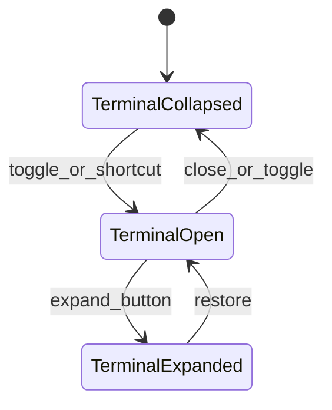

## Summary

Panels **4 and 5** of the [UI design index](../ui-design-index-2026-07-15-230000/PLAN.md):

- **Title bar** — frameless window chrome across full app width
- **Bottom terminal** — xterm panel spanning center + workbench columns only (left edge = right border of left sidebar)

**Differs from Cursor:** terminal is never a right-sidebar tab.

---

## ASCII — full layout with terminal open

```text
┌─ TitleBar (full width, 40px) ───────────────────────────────────────────────┐
│ ●●●  ◀ ▶  [≡] [theme] [glass]     (drag)              [IDE] [workbench] [⋯] │
├──────────┬──────────────────────────────────────────────┬───────────────────┤
│ LEFT     │         CENTER                               │ RIGHT             │
│ SIDEBAR  │                                              │ WORKBENCH         │
│          ├──────────────────────────────────────────────┴───────────────────┤
│          │ ┌─ TerminalPanel ─────────────────────────────────────────────┐ │
│          │ │ zsh │ platform git:(fix-job-id-handling)          [+] [⤢] [×]│ │
│          │ ├───────────────────────────────────────────────────────────────┤ │
│          │ │ $ npm test                                                    │ │
│          │ │ ...                                                           │ │
│          │ ╞═══════════════════════════════════════════════════════════════╡ │
│          │ │ ∥ horizontal resize handle                                    │ │
└──────────┴─┴─────────────────────────────────────────────────────────────────┘
```

## ASCII — terminal collapsed

```text
│          │ (terminal hidden — top stack fills vertical space)              │
│          │ ─── optional thin bar: [ >_ Terminal ] click to expand ──────── │
```

## ASCII — title bar detail

```text
┌────────────────────────────────────────────────────────────────────────────┐
│ [●●●] [◀][▶] [≡sidebar] [☀/🌙] [glass]  ·····drag····  [IDE][▣][⋯]        │
└────────────────────────────────────────────────────────────────────────────┘
  │      │       │          │        │              │      │   │   └─ app menu
  │      │       │          │        │              │      │   └─ right workbench toggle
  │      │       │          │        │              │      └─ IDE layout toggle (max workbench)
  │      │       │          │        └─ vibrancy toggle (existing)
  │      │       │          └─ theme toggle (existing)
  │      │       └─ left sidebar toggle (SidebarTrigger)
  │      └─ back/forward (v1.5)
  └─ WindowControls (Tauri)
```

---

## Title bar — control reference

| Control | Location | Action | Keyboard |
|---------|----------|--------|----------|
| **WindowControls** | Left (macOS) | Close / minimize / maximize | OS default |
| **Back** | After controls | Router history back | `Cmd+[` (v1.5) |
| **Forward** | After back | Router history forward | `Cmd+]` (v1.5) |
| **SidebarTrigger** | Left cluster | Toggle left sidebar expanded/collapsed | `Cmd+B` |
| **ModeToggle** | Left cluster | Light / dark / system theme | — |
| **VibrancyToggle** | Left cluster | Glass/vibrancy on/off | — |
| **Drag region** | Center flex | Move window (`data-tauri-drag-region`) | — |
| **IDE toggle** | Right cluster | Maximize workbench layout / zen editor | `Cmd+Shift+E` (proposed) |
| **RightSidebarTrigger** | Right cluster | Show/hide right workbench | `Cmd+Shift+B` (proposed) |
| **⋯ App menu** | Right | Settings, About, Quit, Toggle terminal | — |

Existing stubs in [`TitleBar.vue`](../../../src/components/navigation/header/TitleBar.vue): `SidebarTrigger`, `ModeToggle`, `VibrancyToggle`, `RightSidebarTrigger`, `WindowControls`.

**IDE toggle (new):** When active, expands workbench to ~60% width and focuses Editor tab. Second click restores prior split.

**App menu ⋯ (new):** Dropdown with Toggle terminal, Open Settings, About Pyrola, Quit.

---

## Bottom terminal — control reference

### A. TerminalPanel chrome

| Control | Action |
|---------|--------|
| **Tab strip** | Multiple PTY sessions; `zsh`, `bash`, or cwd label |
| **+ tab** | New terminal session in active project cwd |
| **Tab ×** | Kill session |
| **⤢ Expand** | Terminal takes full top+bottom height (hides chat temporarily) |
| **× Close panel** | Collapse terminal (not kill sessions) |
| **Resize handle** | Drag top edge to resize vertical split |

### B. xterm viewport

| Behavior | Detail |
|----------|--------|
| **Input** | Keystrokes → PTY via Tauri `write_pty` |
| **Output** | PTY → xterm `write` |
| **Resize** | `resize_pty` on panel dimension change |
| **Cwd** | New sessions start in active project `rootPath` |
| **Agent `run_terminal`** | Harness writes to active terminal tab; user sees output live |
| **Copy/paste** | xterm default + context menu |
| **Link detection** | Cmd+click URLs (v1.5) |

### C. Collapsed state

| Control | Action |
|---------|--------|
| **Title bar menu → Toggle terminal** | Show/hide panel |
| **Keyboard** | `` Ctrl+` `` (proposed) |
| **Thin bar** | Optional 24px bar with "Terminal" label when collapsed |

Sessions persist in memory when panel collapsed; killed only on tab close or quit.

---

## Layout structure (Vue)

```text
SidebarProvider
├── LeftSidebar
└── SidebarInset
    ├── TitleBar (fixed top, full inset width)
    └── ResizablePanelGroup (vertical, flex-1, below title bar)
        ├── ResizablePanel (top — default ~70%)
        │   └── ResizablePanelGroup (horizontal)
        │       ├── CenterPane
        │       └── RightWorkbench (optional)
        ├── ResizableHandle (horizontal)
        └── ResizablePanel (bottom terminal — collapsible, defaultSize 0)
            └── TerminalPanel
```

**Boundary rule:** Terminal `ResizablePanel` is inside `SidebarInset`, not under `LeftSidebar`. Left edge aligns with center pane left edge.

Refactor [`App.vue`](../../../src/App.vue) from current single horizontal split to nested vertical + horizontal per [ide-shell plan](../ide-shell-2026-07-15-215200/PLAN.md).

---

## View states



| State | UI |
|-------|-----|
| `terminalCollapsed` | `defaultSize: 0` on bottom panel; sessions kept |
| `terminalOpen` | Default 30% height; xterm visible |
| `terminalExpanded` | Bottom panel ~80% height; chat compressed |
| `noSessions` | Empty tab shows "New terminal" CTA |

---

## Component map

```text
src/components/navigation/header/
├── TitleBar.vue              # extend with IDE toggle, app menu
├── WindowControls.vue
├── ModeToggle.vue
├── VibrancyToggle.vue
└── AppMenu.vue               # NEW — ⋯ dropdown

src/components/terminal/
├── TerminalPanel.vue
├── TerminalTabBar.vue
└── TerminalViewport.vue      # xterm wrapper

src/composables/
└── use-terminal-store.ts     # sessions, active tab, collapse state
```

---

## Tauri backend (Phase 3+)

| Command | Purpose |
|---------|---------|
| `spawn_pty` | New session with cwd + shell |
| `write_pty` | Send input (user + harness) |
| `resize_pty` | Rows/cols on resize |
| `kill_pty` | Close session |

v1 may use xterm with mock output until PTY lands; UI layout ships first.

---

## Visual spec

- Title bar height: `40px` (`--titlebar-height`); `fixed top-0 inset-x-0 z-50`.
- `data-tauri-drag-region` on header and spacer (existing).
- Terminal panel: `bg-background border-t`; tab bar matches workbench tab styling.
- Resize handle: shadcn `ResizableHandle` horizontal variant, 4px hit area.

---

## Keyboard shortcuts (proposed)

| Shortcut | Action |
|----------|--------|
| `Cmd+B` | Toggle left sidebar |
| `Cmd+Shift+B` | Toggle right workbench |
| `` Ctrl+` `` | Toggle bottom terminal |
| `Cmd+K` | Command palette (center/search) |
| `Cmd+N` | New Agent chat |

Persist shortcut overrides in `~/.pyrola/settings.json` (v1.5).

---

## Deferred (not v1)

| Item | Decision |
|------|----------|
| Back/forward in title bar | v1.5 |
| Terminal split panes | Single tab strip v1 |
| Session restore on relaunch | Memory-only v1 |
| Link detection in xterm | v1.5 |

---

## Definition of done

- Title bar spans full width with documented controls
- Bottom terminal resizes vertically; does not extend under left sidebar
- Terminal toggles from menu + keyboard; collapse preserves sessions
- xterm renders in viewport (mock or PTY)
- `run_terminal` targets active terminal tab when harness wired
- Layout matches nested ResizablePanelGroup structure
- `tsc` + `lint` pass
