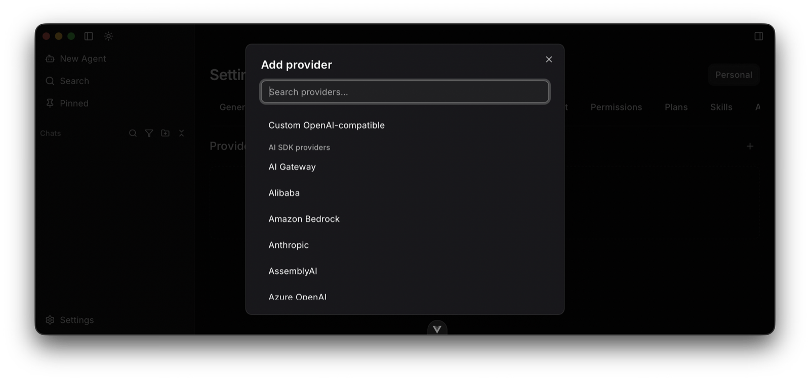
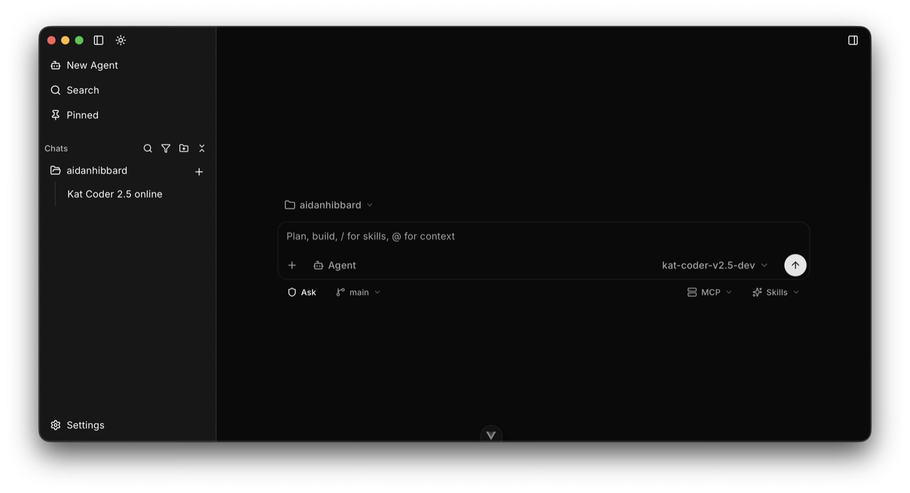
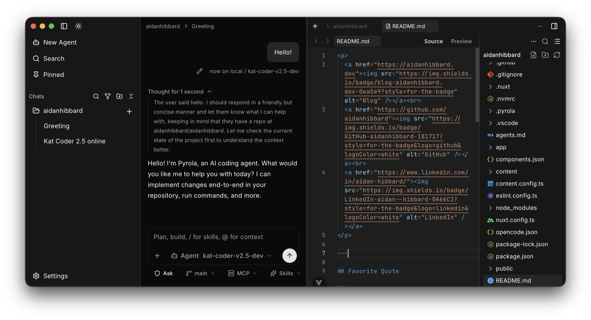
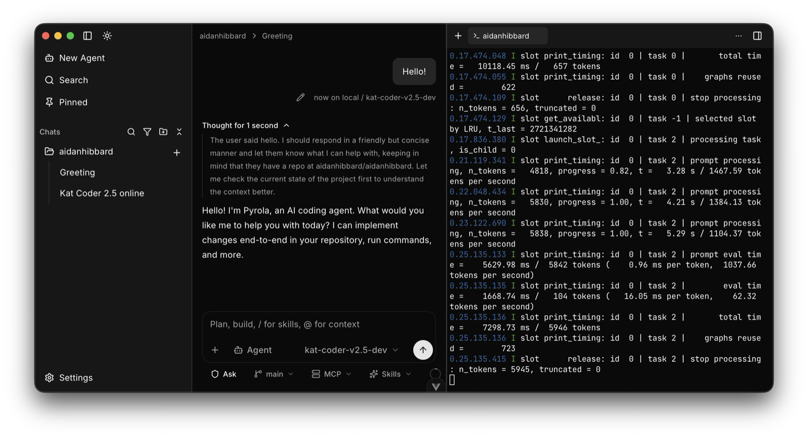

# pyrola

> **Built with LLMs, as a learning project.** This is not a polished product demo funded by frontier-model API spend. I have been driving the work with cheaper models and treating the repo as a place to learn how agent IDEs are put together: harness loops, tools, permissions, Tauri, and UI. Expect rough edges, incomplete surfaces, and opinions that change.

A local-first, bring-your-own-key (BYOK) agent IDE. Vue + Tauri desktop shell, with a streaming agent harness that can use tools, spawn sub-agents, and talk to MCP servers.

It can edit files, run a terminal, show diffs, and (in theory) drive an embedded web view. Some of that works. Some of it is half-finished. That is intentional for now: I would rather ship the learning than fake readiness.

---

## Providers

Any provider the [Vercel AI SDK](https://ai-sdk.dev/) supports, plus custom OpenAI-compatible endpoints.

First-party AI SDK entries (OpenAI, Anthropic, Google, Amazon Bedrock, Azure, AI Gateway, Alibaba, and the rest of the catalog) show up in Settings. You can also add a **Custom OpenAI-compatible** provider with your own base URL, headers, and model list. Keys live in the OS keychain, not in a hosted account.



---

## Honest status

Pyrola is **usable for tinkering**, not something I would trust as a daily driver yet.

| Area | Reality |
|------|---------|
| **Chats** | Streaming threads, modes, tool runs, persistence. The core loop works. |
| **Harness** | Local `streamText` orchestrator with tool loop, mode allowlists, MCP, sub-agents. Real, but still evolving. |
| **Security** | Permissions / approval gates exist and are **half-baked**. Do not treat this as a hardened sandbox. The agent can run shell and write files; policy is best-effort, not a guarantee. |
| **Editor** | Monaco workbench with multi-file tabs, save, dirty state. Fine for light editing. No real LSP integration yet. |
| **Terminal** | Present and usable for agent + human shells. |
| **Sub-agents** | Spawnable; historically constrained (e.g. read-only drill-down). Useful for parallel investigation, not a finished multi-agent product. |

If you clone this expecting Cursor/Claude Code polish, you will be disappointed. If you want to see how one person wires an agent IDE together under LLM-assisted development, you are in the right place.

---

## Features (screenshots)

### Chats

Streaming agent threads with tool calls, modes (Ask / Plan / Studio / Agent), context usage, and project-scoped persistence.



### Editor

Monaco-based workbench: open files from the tree, multi-file tabs, save, markdown preview/split where it exists.



### Terminal

Integrated terminal for the active project; agents can also run shell tools against the same workspace.



---

## What it is trying to be

A **local agent IDE**:

- **BYOK providers**: AI SDK catalog + custom OpenAI-compatible endpoints (see [Providers](#providers)). Keys in settings / OS keychain, not a hosted chat product.
- **Fleet** of projects: register dirs, switch active project, keep chats per project under `~/.pyrola/`.
- **Workbench** tabs: Editor, Terminal, Changes (git informational), plus Plan / Studio flows in chat modes.
- **MCP**: connect stdio / bearer-style servers and call tools from the harness (`call_mcp_tool`). Full OAuth is not there yet.
- **Plans & Studio**: plan docs and studio artifacts for structured agent output (templates exist; polish varies).

Stack sketch: Vue 3 + Vite + Tailwind/shadcn-vue on the front, Rust/Tauri 2 for the desktop shell and IPC, Vercel AI SDK-style streaming for the harness.

---

## Harness, tools, sub-agents

The interesting part of the repo is `src/services/harness/`.

- **Orchestrator** runs a tool loop with mode allowlists (Ask is narrower than Agent).
- **Tools** cover files (read/write/edit/patch), git, terminal, MCP, plans/studio, ask-user gates, and more. See `src/services/harness/tool-catalog.ts`.
- **Sub-agents** can be spawned for parallel work; registry + abort/wait plumbing lives alongside the main chat.
- **Permissions** live in settings and gate some capabilities. Again: **half-baked security**. Useful as a learning surface for policy UX, not a claim that untrusted prompts are safe.

Prompts and mode skills live under `src/prompts/` and `src/skills/`.

---

## CLI

Open Pyrola with an optional project directory (relative paths resolve from your cwd):

```sh
pyrola .
pyrola /path/to/repo
```

On first launch with a path, the project is registered in the fleet (directory name) and set active. If it is already registered, it is activated.

### Installing a `pyrola` command

After `npm run tauri build`, symlink or copy the binary onto your `PATH`. On macOS the release binary is typically:

`src-tauri/target/release/bundle/macos/pyrola.app/Contents/MacOS/pyrola`

```sh
ln -s "/path/to/pyrola.app/Contents/MacOS/pyrola" ~/.local/bin/pyrola
```

Without a PATH install, on macOS:

```sh
open -a pyrola --args /path/to/repo
```

**Limitation:** `pyrola /path` while the app is already running starts a second instance. Single-instance handoff (focus existing window, switch project) is not implemented.

---

## Develop

```sh
npm install
npm run tauri dev   # desktop app
# or
npm run dev         # Vite only (limited without Tauri APIs)
```

Useful scripts:

```sh
npm run ci          # lint + type-check + build
npm run test:unit   # vitest
npm run lint
npm run type-check
```

Recommended editor: VS Code / Cursor with the Vue (Official) extension.

---

## Docs in-repo

Internal plans and status live under `.pyrola/plans/` and `docs/`. Treat them as working notes, not marketing. The roadmap has been “feature-complete for a v1 sketch” in places; that does not mean the product is done.

---

## License / contribution

Personal learning project. If you fork it, assume the API and UX will break under you. Issues and PRs are welcome if you are okay with experimental ground.
