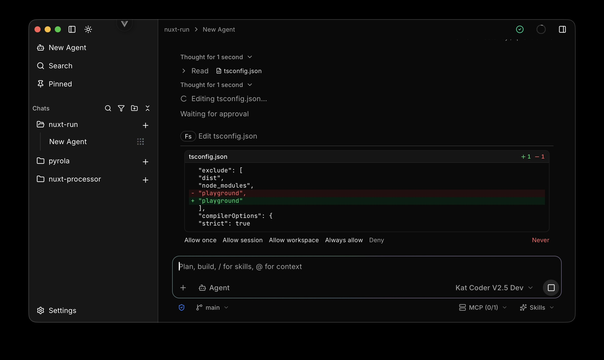
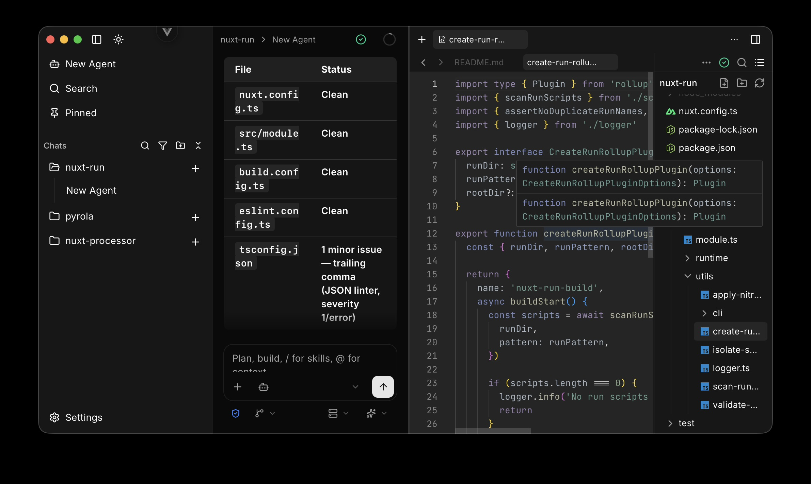
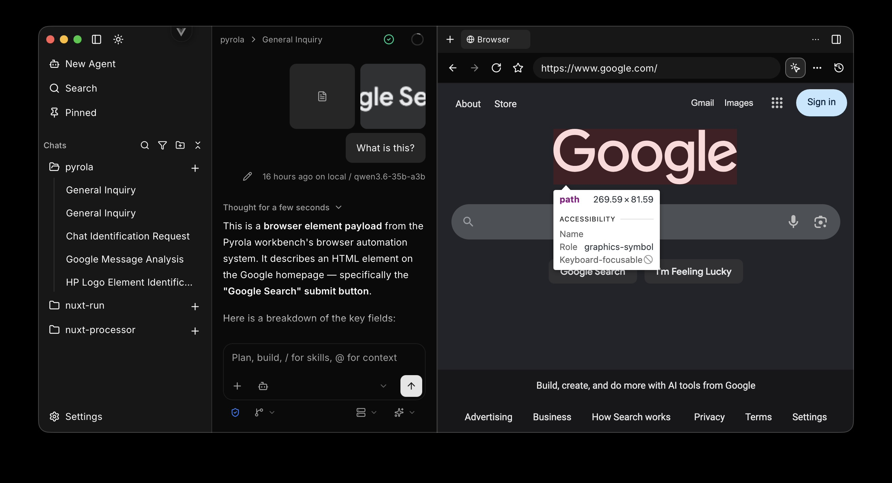
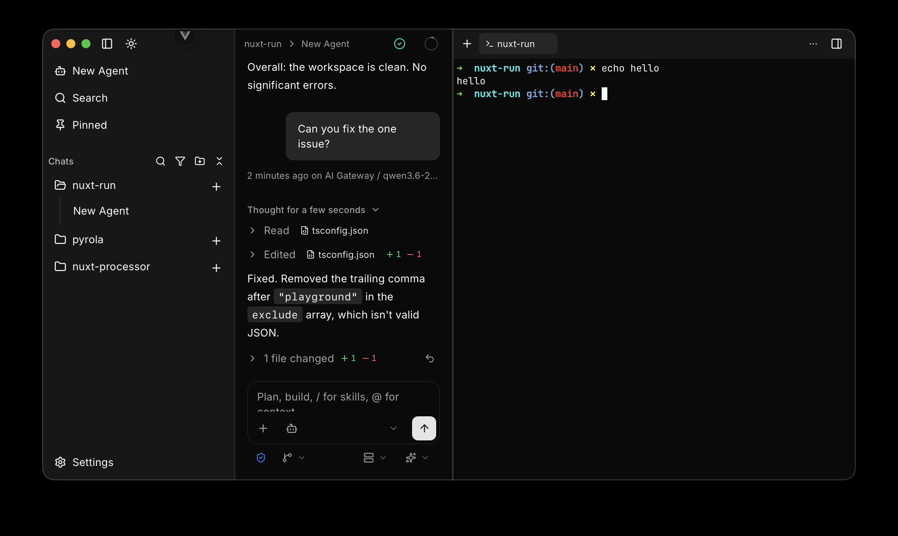

# Pyrola

> We have Antigravity, Cursor Agents, and VS Code Agents, at home!

  
  
  
  
  
  
  

  
  
  
  
  
  
  
  
  
  

## Sponsored by

  

  <a href="https://getminds.ai/">Minds</a>

---

As a developer I got tired of every agents UI trying to encroach into my "workflow," the lock in, and lack of local support.

Cursor pressuring to make commits, prs, and branches on my behalf. Not to mention the fact that it is owned by Elon Musk, and the home of Grok.

If I was going to use slopware, why not make my own?

---

Built on Tauri, Vite, Vue, and AI SDK, Pyrola offers the ability to mix API-based LLM usage with local.

Use frontier LLMs to lead your local Qwen, Laguna, or other models locally.

Or go fully local with custom OpenAI compatible endpoint support.

---

## Getting started

---

## Features:

- Manage fleets of agents across projects

- Full agent coding harness

  

    
  

- Workbench complete with:

  1. Editor using LSPs that your agent shares

  

    
  

  2. Fully integrated browser with CDP

  

    
  

  3. Built in terminals

  

    
  

