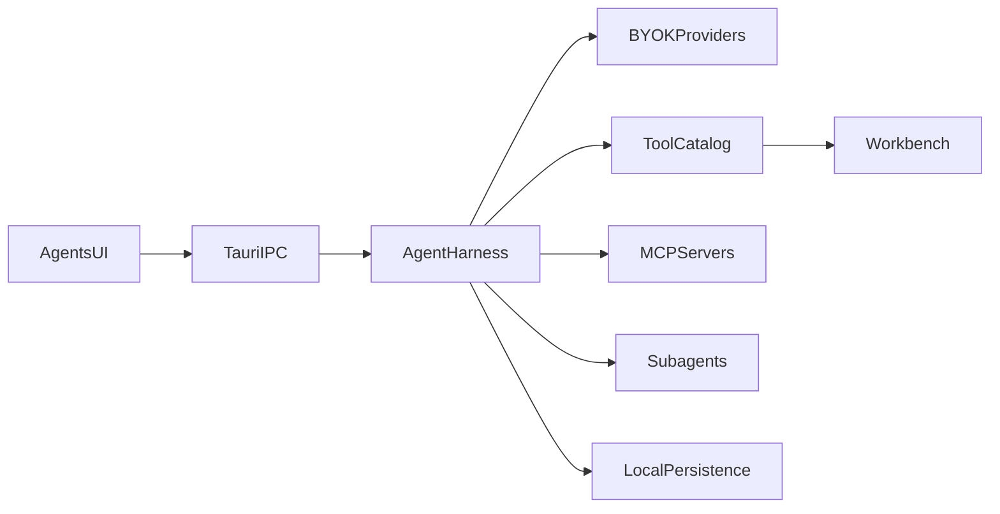

# Architecture overview

Pyrola is a local desktop Agents UI. The Vue app talks to a Tauri shell. The shell reaches a local agent harness that calls BYOK providers, runs tools, talks to MCP, and persists chats on disk.

## Flow

1. You send a prompt in the Agents UI.
2. Tauri IPC carries the turn into the local harness.
3. The harness calls your BYOK provider through the Vercel AI SDK.
4. Tool calls hit the tool catalog (files, git, terminal, LSP, plans, studio) and optional MCP servers.
5. Sub-agents run nested turns when spawned.
6. Workbench tabs reflect files, terminals, plans, and studio artifacts.
7. Persistence writes chats and meta under the app-data `.pyrola/` tree.

## Stack

- **UI:** Vue 3, Vite, Tailwind, shadcn-vue, Monaco, xterm
- **Desktop:** Tauri 2 (Rust)
- **Agents:** Vercel AI SDK streaming harness, MCP SDK

## Related

- [Harness](./harness.md)
- [Data and config](./data-and-config.md)
- [Desktop shell](./desktop-shell.md)
- [What is Pyrola?](../guide/what-is-pyrola.md)
