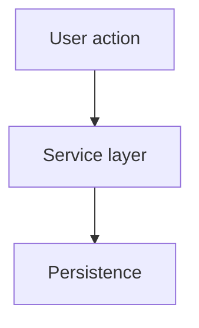

## Summary

Brief description of the goal and expected outcome.

## Context

Relevant background, constraints, and links to related work.

## Architecture

## Approach

Step-by-step implementation plan.

## Test plan

- [ ] Verify core behavior
- [ ] Run type-check and unit tests

## Risks

Optional risks and mitigations.

## Open questions

Optional unresolved decisions.
